# Human Manual

## What This Pack Helps With

turn yantrikdb into an AI memory governance pack with contradiction checks, decay boundaries, recall evals, and recovery rules for polluted agent memory

## How To Use

1. Read `README.md`.
2. Load `AGENTS.md` or `CLAUDE.md`.
3. Run evals.
4. Use pitfall and risk files to recover from failure.

## What This Pack Does Not Do

- It does not replace upstream docs.
- It does not prove production readiness.
- It does not claim official endorsement.

## Doramagic Source Extract

# https://github.com/yantrikos/yantrikdb 项目说明书

生成时间：2026-05-14 04:39:48 UTC

## 目录

- [YantrikDB 简介](#page-introduction)
- [快速开始](#page-quickstart)
- [五大索引架构](#page-five-indexes)
- [解耦写入路径](#page-decoupled-write-path)
- [线程安全与并发模型](#page-threading-model)
- [记录与检索操作](#page-record-recall)
- [知识图谱操作](#page-knowledge-graph)
- [认知循环与思考](#page-cognitive-loop)
- [冲突检测与解决](#page-conflict-detection)
- [主动触发系统](#page-triggers-proactive)

<a id='page-introduction'></a>

## YantrikDB 简介

### 相关页面

相关主题：[快速开始](#page-quickstart), [五大索引架构](#page-five-indexes)

<details>
<summary>相关源码文件</summary>

以下源码文件用于生成本页说明：

- [README.md](https://github.com/yantrikos/yantrikdb/blob/main/README.md)
- [crates/yantrikdb-core/src/cognition/state.rs](https://github.com/yantrikos/yantrikdb/blob/main/crates/yantrikdb-core/src/cognition/state.rs)
- [crates/yantrikdb-core/src/cognition/query_dsl.rs](https://github.com/yantrikos/yantrikdb/blob/main/crates/yantrikdb-core/src/cognition/query_dsl.rs)
- [crates/yantrikdb-core/src/base/types.rs](https://github.com/yantrikos/yantrikdb/blob/main/crates/yantrikdb-core/src/base/types.rs)
- [crates/yantrikdb-python/src/py_engine/memory.rs](https://github.com/yantrikos/yantrikdb/blob/main/crates/yantrikdb-python/src/py_engine/memory.rs)
- [crates/yantrikdb-core/src/cognition/extractor.rs](https://github.com/yantrikos/yantrikdb/blob/main/crates/yantrikdb-core/src/cognition/extractor.rs)
- [crates/yantrikdb-core/src/cognition/personality_bias.rs](https://github.com/yantrikos/yantrikdb/blob/main/crates/yantrikdb-core/src/cognition/personality_bias.rs)
- [crates/yantrikdb-core/src/distributed/conflict.rs](https://github.com/yantrikos/yantrikdb/blob/main/crates/yantrikdb-core/src/distributed/conflict.rs)
</details>

# YantrikDB 简介

## 项目概述

YantrikDB 是一个开源的个人 AI 记忆引擎，采用 Rust 语言实现核心功能，同时提供 Python 语言绑定。它旨在为 AI 助手和大型语言模型（LLM）应用提供持久化的语义记忆能力，帮助 AI 系统记住用户的偏好、上下文信息和历史交互。资料来源：[README.md:1-50]()

YantrikDB 的设计理念是让 AI 记忆系统**开箱即用**，无需复杂的依赖配置或第三方服务。引擎内置了默认的嵌入模型（`potion-base-2M`，约 7MB），直接通过 pip 安装后即可使用 `record_text()` 和 `recall_text()` 接口进行语义记忆的记录和检索。资料来源：[README.md:18-22]()

## 核心架构

YantrikDB 采用模块化架构设计，主要包含三个核心 crate：

| Crate 名称 | 说明 |
|-----------|------|
| yantrikdb-core | 核心认知引擎，包含记忆存储、查询、冲突检测等功能 |
| yantrikdb-python | Python 语言绑定，提供面向 Python 生态的 API |
| yantrikdb-cli | 命令行工具，用于直接操作记忆库 |

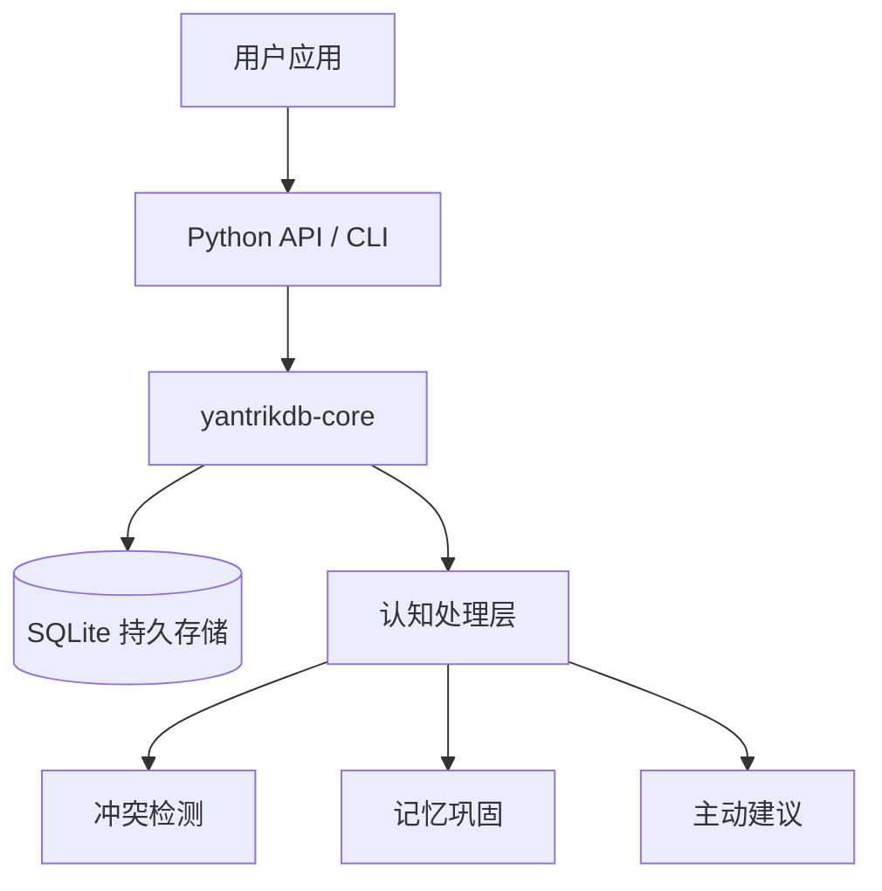

架构的核心层包括：**认知状态管理**、**记忆查询系统**、**冲突检测与解决**、**叙事理解**以及**主动建议生成**。资料来源：[crates/yantrikdb-core/src/cognition/state.rs:1-100]()

## 节点类型系统

YantrikDB 使用统一的图结构来表示所有类型的记忆和认知对象。每种节点类型都有其特定的语义含义和属性。资料来源：[crates/yantrikdb-core/src/cognition/state.rs:100-200]()

### 节点类型一览

| 节点类型 | 英文标识 | 说明 |
|---------|---------|------|
| 实体 | entity | 客观事实或具体对象 |
| 事件 | episode | 时间相关的经历记录 |
| 信念 | belief | 带有置信度的主观认知 |
| 目标 | goal | 期望达成的状态 |
| 任务 | task | 具体的可执行动作项 |
| 意图假设 | intent_hypothesis | 推测的用户意图 |
| 习惯 | routine | 周期性行为模式 |
| 需求 | need | 用户的各种需求 |
| 机会 | opportunity | 时间窗口内的有利时机 |
| 风险 | risk | 潜在的威胁或问题 |
| 约束 | constraint | 限制条件 |
| 偏好 | preference | 用户偏好设置 |
| 对话线程 | conversation_thread | 特定话题的对话上下文 |
| 动作模式 | action_schema | 可复用的动作模板 |

资料来源：[crates/yantrikdb-core/src/cognition/state.rs:200-280]()

### 节点持久化策略

并非所有节点类型都需要持久化存储到 SQLite 数据库中。以下节点类型默认为**瞬态**（transient），仅在工作集中存在：

- `intent_hypothesis`（意图假设）
- `conversation_thread`（对话线程）

其他节点类型默认会持久化存储，支持跨会话记忆保持。资料来源：[crates/yantrikdb-core/src/cognition/state.rs:250-270]()

## 关系边类型

YantrikDB 支持多种关系边类型，每种边类型都有不同的激活传递因子（activation_transfer），用于控制信息在图网络中的传播强度。资料来源：[crates/yantrikdb-core/src/cognition/state.rs:300-400]()

### 强关联边

| 边类型 | 激活传递因子 | 说明 |
|-------|-------------|------|
| causes | 0.8 | 因果关系 |
| supports | 0.7 | 支持关系 |
| triggers | 0.7 | 触发关系 |
| advances_goal | 0.6 | 推进目标 |
| requires | 0.5 | 前置依赖 |
| subtask_of | 0.4 | 子任务归属 |

### 中等关联边

| 边类型 | 激活传递因子 | 说明 |
|-------|-------------|------|
| predicts | 0.4 | 预测关系 |
| associated_with | 0.3 | 关联关系 |
| similar_to | 0.3 | 相似关系 |
| instance_of | 0.3 | 实例关系 |
| part_of | 0.3 | 部分关系 |
| prefers | 0.3 | 偏好关系 |
| precedes_temporally | 0.2 | 时间先后 |

### 抑制边

某些边类型具有负的激活传递因子，表示对目标节点的抑制作用。资料来源：[crates/yantrikdb-core/src/cognition/state.rs:320-380]()

## 认知属性系统

每个认知节点都携带一套统一的属性集，用于描述节点在认知网络中的行为特征。资料来源：[crates/yantrikdb-core/src/cognition/state.rs:400-500]()

### 属性维度

| 属性名称 | 范围 | 说明 |
|---------|------|------|
| confidence | [0.0, 1.0] | 置信度 |
| activation | [0.0, 1.0] | 激活水平 |
| salience | [0.0, 1.0] | 显著性/突出度 |
| persistence | [0.0, 1.0] | 持久度 |
| valence | [-1.0, 1.0] | 情感效价 |
| urgency | [0.0, 1.0] | 紧迫程度 |
| novelty | [0.0, 1.0] | 新颖程度 |
| volatility | [0.0, 1.0] | 波动性 |

### 来源可靠性

节点的可信度与其信息来源（provenance）密切相关：

| 来源类型 | 可靠性先验值 | 说明 |
|---------|-------------|------|
| Told | 0.95 | 用户明确陈述，信任度最高 |
| Observed | 0.90 | 直接观察到的行为 |
| Experimented | 0.85 | 通过实验确认 |
| Consolidated | 0.80 | 多源合并 |
| Extracted | 0.75 | 外部文档提取，可能过时 |
| Inferred | 0.60 | 基于模式的推断 |
| SystemDefault | 0.50 | 系统默认值，最易被覆盖 |

资料来源：[crates/yantrikdb-core/src/cognition/state.rs:380-420]()

## 记忆查询系统

### Python API 查询接口

Python 绑定提供了功能丰富的 `query` 方法，支持多种过滤和检索策略。资料来源：[crates/yantrikdb-python/src/py_engine/memory.rs:50-120]()

```python
db.query(
    query=None,           # 文本查询字符串
    embedding=None,       # 直接传入嵌入向量
    top_k=10,             # 返回前 k 条结果
    memory_type=None,     # 按记忆类型过滤（如 "episodic"）
    namespace=None,       # 按命名空间过滤
    time_window=None,     # 时间窗口过滤 (start_ts, end_ts)
    expand_entities=False,# 是否展开关联实体
    include_consolidated=False,  # 是否包含巩固后的记忆
    skip_reinforce=False, # 是否跳过强化学习步骤
    domain=None,          # 按领域过滤
    source=None           # 按来源过滤
)
```

### 查询操作符

核心认知引擎提供了 DSL 风格的查询操作符系统。资料来源：[crates/yantrikdb-core/src/cognition/query_dsl.rs:1-80]()

| 操作符 | 优先级 | 说明 |
|-------|-------|------|
| Recall | 9 | 上下文检索，关键操作 |
| Believe | 8 | 证据整合 |
| Compare | 7 | 动作选择 |
| Constrain | 7 | 安全约束，始终执行 |
| Plan | 6 | 手段-目标推理 |
| Project | 5 | 前向模拟 |
| Anticipate | 4 | 主动预测 |
| Assess | 3 | 元认知评估 |
| CoherenceCheck | 2 | 一致性检查，资源紧张时可跳过 |

### 查询结果示例

```python
results = db.recall("who leads the team?", top_k=3)
# → [{"text": "Alice is the engineering lead", "score": 1.0}, ...]
```

资料来源：[README.md:30-35]()

## 认知处理流程

### Think 循环

`think()` 方法是 YantrikDB 的核心认知处理入口，执行记忆巩固、冲突检测、模式挖掘等后台任务。资料来源：[README.md:36]()

```mermaid
graph LR
    A[新事件记录] --> B[think() 调用]
    B --> C[记忆巩固]
    B --> D[冲突检测]
    B --> E[模式挖掘]
    B --> F[主动建议生成]
    C --> G[衰减处理]
    D --> H{检测到冲突?}
    H -->|是| I[冲突解决]
    H -->|否| J[输出建议]
    I --> J
```

### 冲突检测与解决

YantrikDB 实现了完整的冲突检测和解决机制。冲突类型包括：资料来源：[crates/yantrikdb-core/src/base/types.rs:50-100]()

| 冲突类型 | 默认优先级 | 说明 |
|---------|-----------|------|
| IdentityFact | critical | 身份事实冲突 |
| Preference | high | 偏好冲突 |
| Temporal | high | 时间冲突 |
| Consolidation | medium | 合并冲突 |
| Minor | low | 次要冲突 |

冲突检测策略包括检查关系策略（relation_policies），考虑命名空间级别的配置。资料来源：[crates/yantrikdb-core/src/distributed/conflict.rs:80-120]()

## 个性化系统

### 人格偏差维度

YantrikDB 包含一个人格偏差系统，包含 8 个可配置的维度，用于调整系统行为以适应用户偏好。资料来源：[crates/yantrikdb-core/src/cognition/personality_bias.rs:1-80]()

| 维度名称 | 说明 |
|---------|------|
| curiosity | 好奇心 - 对新信息的探索倾向 |
| proactivity | 主动性 - 主动干预的程度 |
| caution | 谨慎性 - 行动前的风险评估 |
| warmth | 温暖度 - 情感表达的程度 |
| efficiency | 效率优先 - 完成任务的速度 |
| playfulness | 趣味性 - 互动风格 |
| formality | 正式程度 - 沟通风格 |
| persistence | 坚持度 - 持续跟进的能力 |

这些维度支持余弦相似度计算，可用于比较不同人格配置或与用户偏好进行匹配。资料来源：[crates/yantrikdb-core/src/cognition/personality_bias.rs:60-80]()

## 叙事理解

YantrikDB 包含叙事理解子系统，用于追踪和管理用户生活中的长期叙事弧线。资料来源：[crates/yantrikdb-core/src/cognition/narrative.rs:1-60]()

### 叙事弧线状态

| 状态 | 说明 |
|-----|------|
| Emerging | 刚检测到，尚未确认 |
| Active | 活跃积累中 |
| Paused | 暂停，可能恢复 |
| Resolved | 目标达成或故事结束 |
| Abandoned | 停止追踪 |

### 章节类型

| 类型 | 说明 |
|-----|------|
| Setup | 初始情境设定 |
| Rising | 上升/进展 |
| Climax | 高潮时刻 |
| Falling | 回落/收尾 |
| Resolution | 最终结论 |
| Interlude | 插曲/过渡 |

## 任务与目标管理

### 任务状态机

YantrikDB 内置完整的任务管理功能，支持任务生命周期管理。资料来源：[crates/yantrikdb-core/src/cognition/state.rs:150-200]()

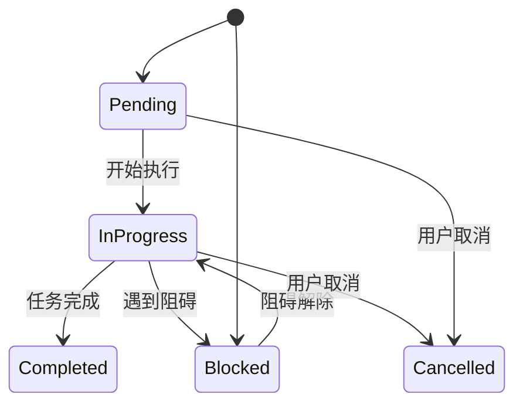

### 优先级等级

| 优先级 | 系数 |
|-------|------|
| Low | 0.25 |
| Medium | 0.50 |
| High | 0.75 |
| Critical | 1.00 |

## 接受度与主动建议

YantrikDB 的主动建议系统会考虑用户的当前状态和偏好。资料来源：[crates/yantrikdb-core/src/cognition/surfacing.rs:1-50]()

### 用户活动状态

| 状态 | 中断成本 | 接收度 |
|-----|---------|-------|
| Idle | 0.20 | 0.70 |
| JustReturned | 0.30 | 0.65 |
| Browsing | 0.40 | 0.60 |
| Communicating | 0.50 | 0.55 |
| TaskSwitching | 0.55 | 0.45 |
| FocusedWork | 0.75 | 0.30 |
| DeepFocus | 0.95 | 0.10 |

### 通知模式

| 模式 | 说明 |
|-----|------|
| All | 允许所有通知 |
| ImportantOnly | 仅重要通知 |
| DoNotDisturb | 完全免打扰 |

## 动作系统

### 动作类型

YantrikDB 定义了多种动作类型，每种类型有不同的基础成本：资料来源：[crates/yantrikdb-core/src/cognition/state.rs:450-520]()

| 动作类型 | 基础成本 | 说明 |
|---------|---------|------|
| Abstain | 0.0 | 无操作 |
| Inform | 0.05 | 信息告知 |
| Organize | 0.10 | 整理组织 |
| Suggest | 0.15 | 建议提议 |
| Communicate | 0.20 | 沟通交流 |
| Schedule | 0.25 | 日程安排 |
| Warn | 0.30 | 警告提醒 |
| Execute | 0.35 | 直接执行 |

## 快速开始

### 安装

```bash
pip install yantrikdb
```

### Python 使用示例

```python
import yantrikdb

# 初始化数据库，使用内置嵌入模型
db = yantrikdb.YantrikDB.with_default("memory.db")

# 记录重要信息
db.record("Alice 是工程主管", importance=0.8, domain="people")
db.record("项目截止日期是 3 月 30 日", importance=0.9, domain="work")
db.record("用户偏好深色模式", importance=0.6, domain="preference")

# 语义检索
results = db.recall("谁是团队负责人?", top_k=3)

# 建立关系
db.relate("Alice", "Engineering", "leads")
db.get_edges("Alice")

# 执行认知处理
db.think()

db.close()
```

资料来源：[README.md:14-45]()

## 技术特点总结

| 特性 | 说明 |
|-----|------|
| 开箱即用 | 内置嵌入模型，无需额外依赖 |
| 多语言支持 | Python API + CLI 工具 |
| 图数据库 | 支持复杂关系建模 |
| 持久化存储 | SQLite 本地存储 |
| 认知计算 | 内置冲突检测、模式挖掘、叙事理解 |
| 个性化 | 8 维人格偏差系统 |
| 主动建议 | 基于用户状态智能推送 |

---

<a id='page-quickstart'></a>

## 快速开始

### 相关页面

相关主题：[YantrikDB 简介](#page-introduction), [记录与检索操作](#page-record-recall)

<details>
<summary>相关源码文件</summary>

以下源码文件用于生成本页说明：

- [README.md](https://github.com/yantrikos/yantrikdb/blob/main/README.md)
- [pyproject.toml](https://github.com/yantrikos/yantrikdb/blob/main/pyproject.toml)
- [crates/yantrikdb-python/src/py_engine/memory.rs](https://github.com/yantrikos/yantrikdb/blob/main/crates/yantrikdb-python/src/py_engine/memory.rs)
- [crates/yantrikdb-python/src/py_engine/sync.rs](https://github.com/yantrikos/yantrikdb/blob/main/crates/yantrikdb-python/src/py_engine/sync.rs)
- [crates/yantrikdb-core/src/engine/query_dsl.rs](https://github.com/yantrikos/yantrikdb/blob/main/crates/yantrikdb-core/src/engine/query_dsl.rs)
- [crates/yantrikdb-core/src/cognition/query_dsl.rs](https://github.com/yantrikos/yantrikdb/blob/main/crates/yantrikdb-core/src/cognition/query_dsl.rs)
- [crates/yantrikdb-core/src/cognition/state.rs](https://github.com/yantrikos/yantrikdb/blob/main/crates/yantrikdb-core/src/cognition/state.rs)
</details>

# 快速开始

本文档为开发者提供 YantrikDB 的入门指南，帮助您快速了解系统架构、安装配置以及核心 API 的使用方法。

## 系统概述

YantrikDB 是一个基于 Rust 构建的认知记忆数据库，设计用于 AI 个人助手应用场景。它通过混合索引架构（DeltaIndex + HNSW）实现高效的记忆存储与检索，并提供完整的认知推理能力。

**核心特性：**

- 混合索引架构：DeltaIndex（增量索引）与 HNSW（分层可导航小世界图）结合
- 多模态记忆支持：情景记忆、语义记忆、工作记忆
- 认知引擎：支持注意力扩散、信念整合、规划推理等认知操作
- 冲突检测与解决：自动检测记忆冲突并提供解决策略
- 复制与同步：基于 HLC（混合逻辑时钟）的操作复制

## 安装配置

### 环境要求

| 要求 | 版本 |
|------|------|
| Python | ≥ 3.10 |
| Rust | ≥ 1.70 |

### 安装步骤

```bash
# 从源码编译
cargo build --release

# 安装 Python 包
pip install -e .
```

## 核心概念

### 记忆类型

系统支持多种记忆类型，每种类型对应不同的存储和检索策略：

| 记忆类型 | 说明 | 持久化 |
|----------|------|--------|
| Entity | 实体节点（人、地点、事物） | ✓ |
| Episode | 情景记忆（事件片段） | ✓ |
| Belief | 信念（带置信度） | ✓ |
| Goal | 目标节点 | ✓ |
| Task | 任务项（带状态） | ✓ |
| IntentHypothesis | 意图假设 | ✗（默认） |
| Routine | 例行行为模式 | ✓ |
| Need | 需求（分类层级） | ✓ |
| Opportunity | 机会（有时限） | ✓ |
| Risk | 风险 | ✓ |
| Constraint | 约束条件 | ✓ |
| Preference | 用户偏好 | ✓ |
| ConversationThread | 对话线程 | ✗（默认） |
| ActionSchema | 动作模式 | ✓ |

### 认知节点状态

任务（Task）具有完整的状态机：

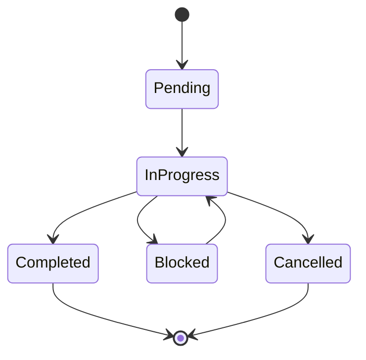

### 边类型与激活传递

认知节点通过边连接，系统使用激活扩散算法进行推理：

| 边类型 | 激活传递值 | 说明 |
|--------|-----------|------|
| Causes | 0.8 | 因果关系 |
| Supports | 0.7 | 支持关系 |
| Triggers | 0.7 | 触发关系 |
| AdvancesGoal | 0.6 | 推进目标 |
| Requires | 0.5 | 依赖关系 |
| SubtaskOf | 0.4 | 子任务关系 |
| Predicts | 0.4 | 预测关系 |
| AssociatedWith | 0.3 | 关联关系 |
| SimilarTo | 0.3 | 相似关系 |
| Contradicts | -0.5 | 矛盾关系（抑制） |
| BlocksGoal | -0.5 | 阻塞目标（抑制） |
| Prevents | -0.6 | 阻止关系（抑制） |

## Python API 快速使用

### 初始化数据库

```python
from yantrikdb import YantrikDB

# 初始化数据库
db = YantrikDB(
    path="./yantrik_data",
    namespace="default"
)
```

### 记忆查询

`query` 方法是核心检索接口，支持向量相似度搜索：

```python
# 使用文本查询
results = db.query(
    query="今天下午的会议内容",
    top_k=10,
    memory_type="episode",
    namespace="work"
)

# 使用向量嵌入
results = db.query(
    embedding=[0.1, 0.2, 0.3, ...],
    top_k=5
)
```

**参数说明：**

| 参数 | 类型 | 默认值 | 说明 |
|------|------|--------|------|
| query | str | None | 自然语言查询 |
| embedding | List[float] | None | 向量嵌入 |
| top_k | int | 10 | 返回结果数量 |
| memory_type | str | None | 记忆类型过滤 |
| namespace | str | None | 命名空间过滤 |
| time_window | Tuple[float, float] | None | 时间窗口（unix时间戳） |
| expand_entities | bool | False | 展开关联实体 |
| include_consolidated | bool | False | 包含已整合记忆 |
| domain | str | None | 领域过滤 |
| source | str | None | 来源过滤 |

### 操作同步

系统提供操作日志的提取和应用接口：

```python
# 提取指定时间点之后的操作
ops = db.extract_ops_since(
    since_hlc=hlc_bytes,
    since_op_id="op_123",
    exclude_actor=None,
    limit=100
)

# 应用远程操作
db.apply_ops(ops)
```

**操作结构：**

| 字段 | 类型 | 说明 |
|------|------|------|
| op_id | str | 操作唯一标识 |
| op_type | str | 操作类型 |
| timestamp | float | 时间戳 |
| target_rid | str | 目标资源ID |
| payload | dict | 操作载荷 |
| actor_id | str | 执行者ID |
| hlc | bytes | HLC 逻辑时钟 |
| embedding_hash | str | 嵌入哈希 |
| origin_actor | str | 原始执行者 |

## 认知引擎操作

### 操作类型体系

认知引擎通过 DSL 定义认知操作：

| 操作 | 优先级 | 说明 |
|------|--------|------|
| Attend | 10 | 注意力聚焦 |
| Recall | 9 | 记忆召回 |
| Believe | 8 | 信念整合 |
| Compare | 7 | 行动比较 |
| Constrain | 7 | 约束检查 |
| Plan | 6 | 规划推理 |
| Project | 5 | 未来投影 |
| Anticipate | 4 | 主动预期 |
| Assess | 3 | 元认知评估 |
| CoherenceCheck | 2 | 一致性检查 |

### 注意力操作

```python
# 聚焦特定节点并扩散激活
result = db.think(
    operation="attend",
    seeds=["node_id_1", "node_id_2"],
    max_hops=3,
    decay=0.9
)
```

### 信念整合

```python
# 整合新证据到信念网络
result = db.think(
    operation="believe",
    evidence={
        "target": "belief_node_id",  # 可选，None则创建新信念
        "observation": "用户今天说喜欢喝咖啡",
        "direction": "positive"        # positive=确认, negative=矛盾
    }
)
```

## 需求分类系统

系统内置完整的需求分类层级：

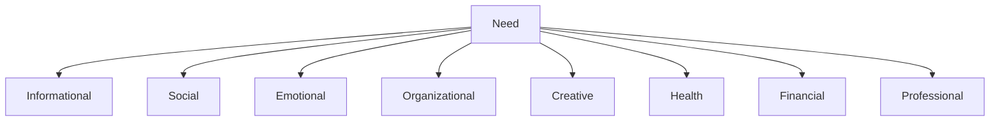

| 类别 | 标识符 |
|------|--------|
| 信息需求 | informational |
| 社交需求 | social |
| 情感需求 | emotional |
| 组织需求 | organizational |
| 创造需求 | creative |
| 健康需求 | health |
| 财务需求 | financial |
| 职业需求 | professional |

## 冲突检测与解决

### 冲突类型

| 类型 | 标识符 | 默认优先级 |
|------|--------|-----------|
| 身份事实冲突 | identity_fact | critical |
| 偏好冲突 | preference | high |
| 时间冲突 | temporal | high |
| 整合冲突 | consolidation | medium |
| 轻微冲突 | minor | low |

### 冲突结构

```python
class Conflict:
    conflict_id: str           # 冲突唯一ID
    conflict_type: str          # 冲突类型
    priority: str               # 优先级
    status: str                 # 状态
    memory_a: str               # 冲突方A
    memory_b: str               # 冲突方B
    entity: Optional[str]       # 相关实体
    detected_at: float          # 检测时间
    detected_by: str            # 检测方法
    resolution_note: Optional[str]  # 解决说明
```

## 叙事弧线追踪

系统支持叙事弧线（Narrative Arc）来理解用户生活中的长期主题：

**弧线类型：**

- Project（项目）
- Habit（习惯）
- Relationship（关系）
- Discovery（发现）
- Loss（失去）
- Recovery（恢复）

**弧线状态：**

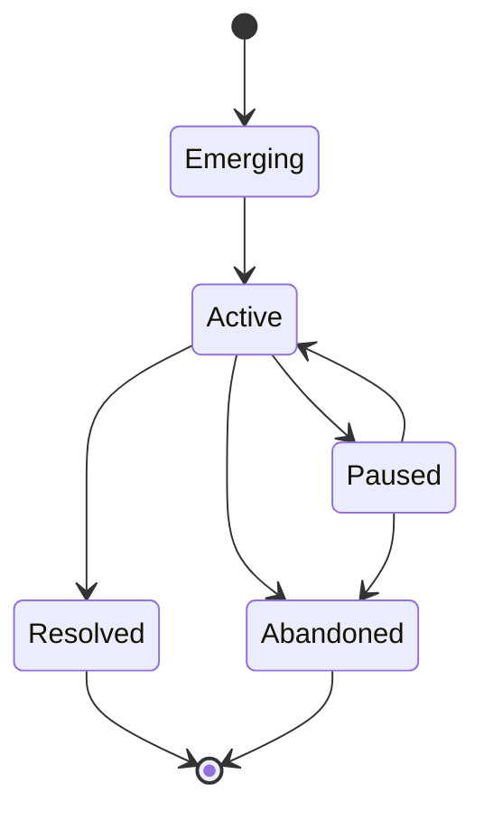

## 完整示例

```python
from yantrikdb import YantrikDB

# 1. 初始化
db = YantrikDB(path="./data", namespace="user_001")

# 2. 记录情景记忆
db.remember(
    text="用户下午3点与张经理开会讨论Q4计划",
    memory_type="episode",
    entities=["张经理"],
    domain="work"
)

# 3. 创建关联任务
db.think(operation="create_task", description="跟进Q4计划讨论结果")

# 4. 设置偏好
db.set_preference(domain="notifications", preferred="静默模式")

# 5. 查询相关记忆
results = db.query(
    query="Q4计划相关",
    top_k=5,
    memory_type=["episode", "task"],
    expand_entities=True
)

# 6. 提取同步数据（用于多设备同步）
ops = db.extract_ops_since(since_op_id="last_sync_id")
```

## 下一步

- 查看 [架构设计](./architecture.md) 深入了解系统内部实现
- 参考 [API 文档](./api_reference.md) 获取完整接口说明
- 阅读 [认知引擎](./cognitive_engine.md) 了解推理机制
- 查看 [复制协议](./replication.md) 学习多节点同步

---

<a id='page-five-indexes'></a>

## 五大索引架构

### 相关页面

相关主题：[YantrikDB 简介](#page-introduction), [解耦写入路径](#page-decoupled-write-path), [知识图谱操作](#page-knowledge-graph)

<details>
<summary>相关源码文件</summary>

以下源码文件用于生成本页说明：

- [crates/yantrikdb-core/src/vector/hnsw.rs](https://github.com/yantrikos/yantrikdb/blob/main/crates/yantrikdb-core/src/vector/hnsw.rs)
- [crates/yantrikdb-core/src/vector/delta_index.rs](https://github.com/yantrikos/yantrikdb/blob/main/crates/yantrikdb-core/src/vector/delta_index.rs)
- [crates/yantrikdb-core/src/knowledge/graph.rs](https://github.com/yantrikos/yantrikdb/blob/main/crates/yantrikdb-core/src/knowledge/graph.rs)
- [crates/yantrikdb-core/src/knowledge/graph_index.rs](https://github.com/yantrikos/yantrikdb/blob/main/crates/yantrikdb-core/src/knowledge/graph_index.rs)
- [crates/yantrikdb-core/src/engine/indices.rs](https://github.com/yantrikos/yantrikdb/blob/main/crates/yantrikdb-core/src/engine/indices.rs)
</details>

# 五大索引架构

## 概述

yantrikdb 采用多层次、多类型的索引架构来支撑知识存储与检索能力。根据源码组织结构，该系统主要包含五大索引组件：

| 索引类型 | 源码位置 | 主要用途 |
|---------|---------|---------|
| HNSW 向量索引 | `vector/hnsw.rs` | 高维向量相似性搜索 |
| Delta 索引 | `vector/delta_index.rs` | 增量数据变更追踪 |
| 知识图谱索引 | `knowledge/graph.rs` | 实体关系网络存储 |
| 图索引 | `knowledge/graph_index.rs` | 图遍历查询优化 |
| 引擎索引 | `engine/indices.rs` | 统一索引协调管理 |

资料来源：[crates/yantrikdb-core/src/engine/indices.rs](https://github.com/yantrikos/yantrikdb/blob/main/crates/yantrikdb-core/src/engine/indices.rs)

---

## 一、HNSW 向量索引

### 1.1 架构设计

HNSW（Hierarchical Navigable Small World）是一种基于概率跳表结构的近似最近邻搜索算法，在 yantrikdb 中用于支持语义相似性检索。

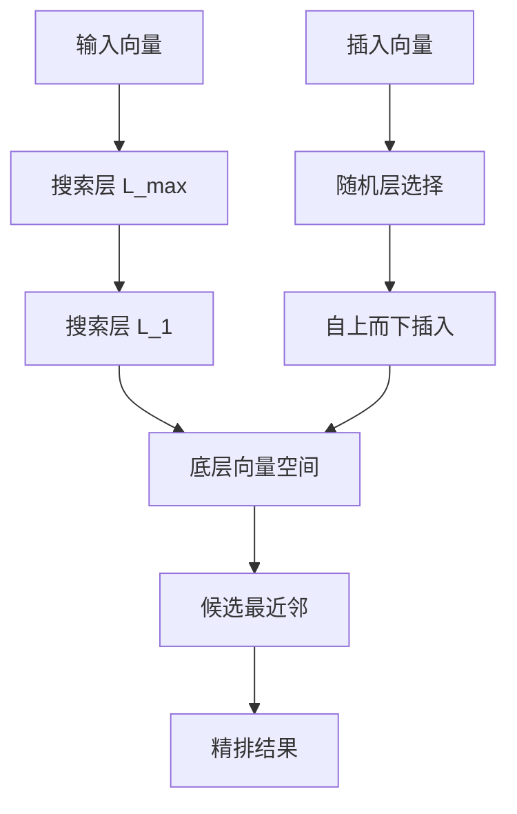

### 1.2 核心特性

- **分层结构**：构建多层 skip list，每层跳过的距离逐渐缩小
- **贪心搜索**：在每层执行贪心遍历寻找最优邻居
- **ef_construction 参数**：控制构建时候选集大小，影响索引质量与构建时间
- **ef_search 参数**：控制搜索时候选集大小，影响查询精度与延迟

### 1.3 应用场景

| 场景 | 说明 |
|-----|------|
| 语义记忆检索 | 基于文本 embedding 查找相关记忆 |
| 向量相似匹配 | 支持余弦相似度、欧氏距离等度量 |
| 召回阶段加速 | 在大规模候选集中快速定位 top-k |

资料来源：[crates/yantrikdb-core/src/vector/hnsw.rs](https://github.com/yantrikos/yantrikdb/blob/main/crates/yantrikdb-core/src/vector/hnsw.rs)

---

## 二、Delta 索引

### 2.1 设计目的

Delta 索引用于追踪和管理增量变更，避免频繁全量重建索引带来的性能开销。

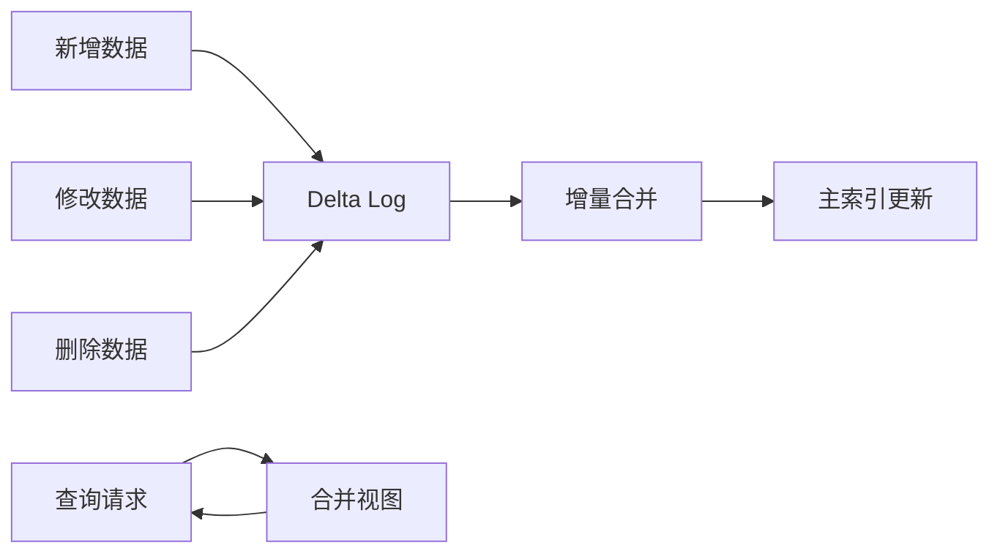

### 2.2 核心数据结构

Delta 索引维护一个变更日志，包含以下操作类型：

| 操作类型 | 说明 | 对索引的影响 |
|---------|------|-------------|
| INSERT | 新增记录 | 追加到索引末尾 |
| UPDATE | 更新记录 | 标记旧版本、插入新版本 |
| DELETE | 删除记录 | 软删除或版本号标记 |

### 2.3 合并策略

- **定期合并**：定时将 delta 变更合并回主索引
- **阈值触发**：当 delta 大小超过阈值时触发合并
- **写时合并**：高写入场景采用 LSM-tree 风格的合并策略

资料来源：[crates/yantrikdb-core/src/vector/delta_index.rs](https://github.com/yantrikos/yantrikdb/blob/main/crates/yantrikdb-core/src/vector/delta_index.rs)

---

## 三、知识图谱索引

### 3.1 图模型

yantrikdb 的知识图谱采用属性图模型，支持多类型节点和关系边。

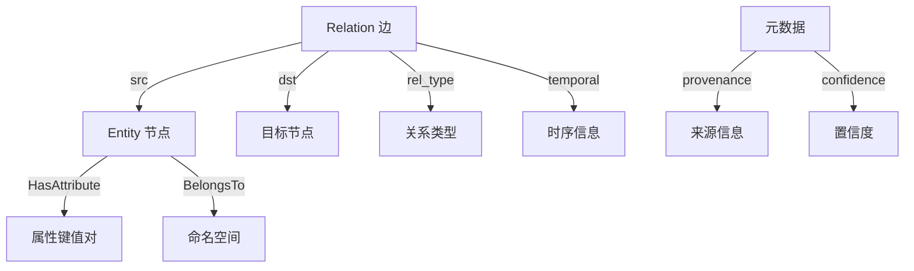

### 3.2 节点类型体系

系统支持多种认知节点类型，通过 `NodeKind` 枚举统一管理：

| 节点类型 | 英文标识 | 持久化 | 说明 |
|---------|---------|-------|------|
| 实体 | entity | ✓ | 事实性信息 |
| 事件 | episode | ✓ | 时序发生的事件 |
| 信念 | belief | ✓ | 带有置信度的认知 |
| 目标 | goal | ✓ | 用户意图目标 |
| 任务 | task | ✓ | 具体行动项 |
| 意图假设 | intent_hypothesis | ✗ | 临时推理结果 |
| 习惯 | routine | ✓ | 周期性行为 |
| 需求 | need | ✓ | 用户需求分类 |
| 机会 | opportunity | ✓ | 时限性机会 |
| 风险 | risk | ✓ | 潜在问题 |
| 约束 | constraint | ✓ | 限制条件 |
| 偏好 | preference | ✓ | 用户偏好设置 |
| 对话线索 | conversation_thread | ✗ | 临时对话状态 |
| 行动模式 | action_schema | ✓ | 可执行动作模板 |

资料来源：[crates/yantrikdb-core/src/knowledge/graph.rs](https://github.com/yantrikos/yantrikdb/blob/main/crates/yantrikdb-core/src/knowledge/graph.rs)

### 3.3 边类型与激活传递

边类型定义了节点间的语义关联强度，影响激活传播算法：

| 关系类型 | 激活传递系数 | 说明 |
|---------|-------------|------|
| causes | 0.8 | 强因果关系 |
| supports | 0.7 | 支持关系 |
| triggers | 0.7 | 触发关系 |
| advances_goal | 0.6 | 推进目标 |
| requires | 0.5 | 依赖关系 |
| subtask_of | 0.4 | 子任务关系 |
| predicts | 0.4 | 预测关系 |
| associated_with | 0.3 | 关联关系 |
| similar_to | 0.3 | 相似关系 |
| precedes_temporally | 0.2 | 时序先导 |
| contradicts | -0.5 | 矛盾关系 |
| blocks_goal | -0.6 | 阻碍目标 |

资料来源：[crates/yantrikdb-core/src/knowledge/graph.rs](https://github.com/yantrikos/yantrikdb/blob/main/crates/yantrikdb-core/src/knowledge/graph.rs)

---

## 四、图索引

### 4.1 索引构建策略

图索引针对知识图谱的查询模式进行专门优化，支持多种索引类型：

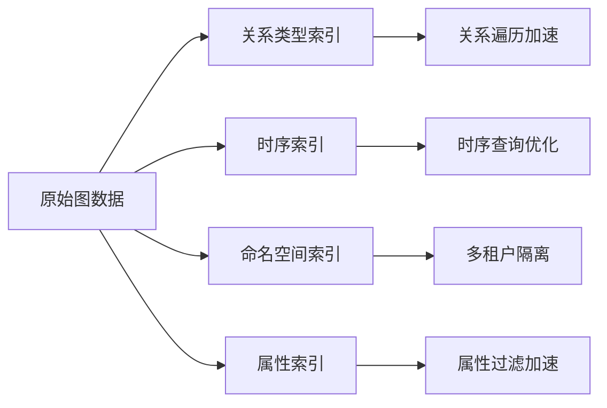

### 4.2 查询优化

| 优化类型 | 实现方式 | 适用场景 |
|---------|---------|---------|
| 入度/出度索引 | 预计算节点连接数 | 度过滤查询 |
| 邻接列表 | 按关系类型分组存储 | 批量遍历 |
| 时序索引 | B-Tree 或 LSM-Tree | 范围查询 |
| 命名空间索引 | Hash 分区 | 多租户隔离 |

### 4.3 冲突检测

图索引支持基于命名空间策略的冲突检测：

- **overlap_allowed**：是否允许同一关系类型的重叠
- **temporal_required**：是否要求时序约束
- **missing_time_severity**：缺失时序信息的严重级别

资料来源：[crates/yantrikdb-core/src/knowledge/graph_index.rs](https://github.com/yantrikos/yantrikdb/blob/main/crates/yantrikdb-core/src/knowledge/graph_index.rs)

---

## 五、引擎索引协调层

### 5.1 统一索引接口

引擎索引作为协调层，统一管理上述各类索引的创建、查询和生命周期：

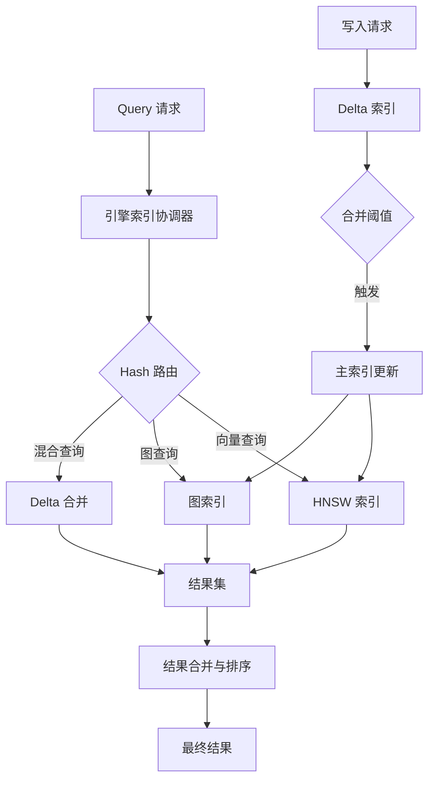

### 5.2 索引配置参数

| 参数 | 类型 | 默认值 | 说明 |
|-----|------|-------|------|
| hnsw_ef_construction | u32 | 100 | HNSW 构建参数 |
| hnsw_ef_search | u32 | 50 | HNSW 搜索参数 |
| hnsw_m | u32 | 16 | HNSW 邻居数 |
| delta_merge_threshold | usize | 10000 | Delta 合并阈值 |
| graph_cache_size | usize | 1000 | 图索引缓存大小 |

### 5.3 索引生命周期

| 阶段 | 操作 | 说明 |
|-----|------|------|
| 创建 | `create_index()` | 根据配置初始化索引结构 |
| 写入 | `insert()` / `upsert()` | 添加或更新索引数据 |
| 查询 | `search()` / `query()` | 执行索引检索 |
| 合并 | `merge_delta()` | 将增量合并回主索引 |
| 重建 | `rebuild()` | 全量重建索引 |
| 删除 | `drop_index()` | 清理索引资源 |

资料来源：[crates/yantrikdb-core/src/engine/indices.rs](https://github.com/yantrikos/yantrikdb/blob/main/crates/yantrikdb-core/src/engine/indices.rs)

---

## 六、协同工作流程

### 6.1 写入流程

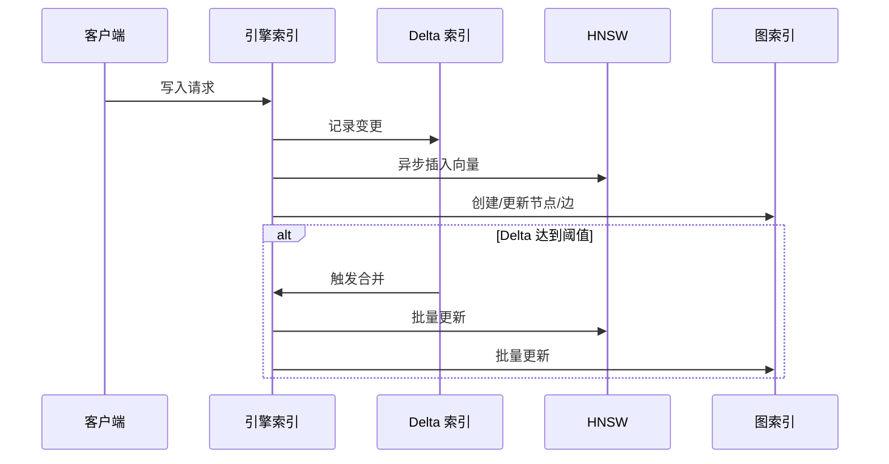

### 6.2 查询流程

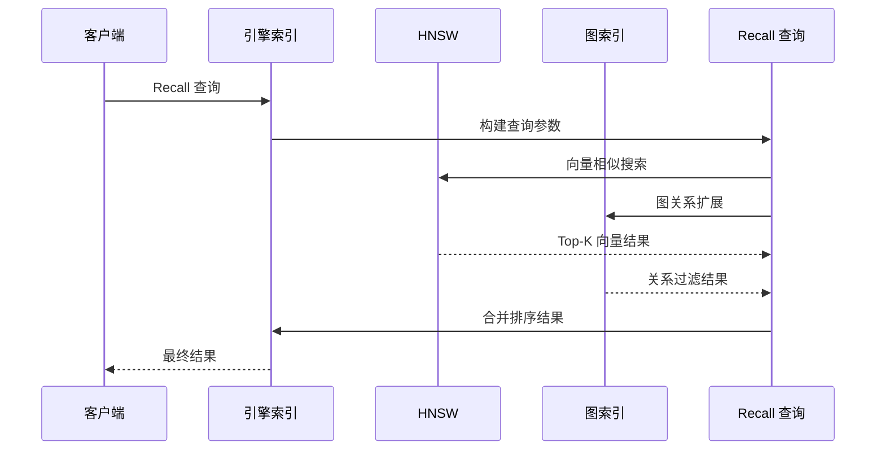

### 6.3 认知查询语言集成

系统通过 `RecallQuery` 结构支持组合查询：

| 参数 | 类型 | 说明 |
|-----|------|------|
| embedding | Vec<f32> | 查询向量 |
| top_k | usize | 返回结果数量 |
| memory_type | Option<&str> | 记忆类型过滤 |
| namespace | Option<&str> | 命名空间隔离 |
| time_window | Option<(f64, f64)> | 时序范围 |
| domain | Option<&str> | 领域过滤 |
| source | Option<&str> | 来源过滤 |

---

## 七、总结

yantrikdb 的五大索引架构通过分层设计实现了高效的知识存储与检索：

1. **HNSW 向量索引**：提供亚线性时间复杂度的近似最近邻搜索能力
2. **Delta 索引**：通过增量变更追踪实现高写入性能
3. **知识图谱索引**：支持丰富的语义关系建模
4. **图索引**：针对图遍历操作进行专门优化
5. **引擎索引协调层**：统一管理各类索引，提供一致的查询接口

这些索引组件相互协作，共同支撑了 yantrikdb 作为认知数据库的核心功能。

---

<a id='page-decoupled-write-path'></a>

## 解耦写入路径

### 相关页面

相关主题：[五大索引架构](#page-five-indexes), [线程安全与并发模型](#page-threading-model)

<details>
<summary>相关源码文件</summary>

以下源码文件用于生成本页说明：

- [docs/decoupled_write_path_rfc.md](https://github.com/yantrikos/yantrikdb/blob/main/docs/decoupled_write_path_rfc.md)
- [CONCURRENCY.md](https://github.com/yantrikos/yantrikdb/blob/main/CONCURRENCY.md)
- [crates/yantrikdb-core/src/vector/delta_index.rs](https://github.com/yantrikos/yantrikdb/blob/main/crates/yantrikdb-core/src/vector/delta_index.rs)
- [crates/yantrikdb-core/src/engine/materializer.rs](https://github.com/yantrikos/yantrikdb/blob/main/crates/yantrikdb-core/src/engine/materializer.rs)
</details>

# 解耦写入路径

## 概述

解耦写入路径（Decoupled Write Path）是 yantrikdb 中一项核心架构设计，旨在将前台写入操作与向量索引维护工作彻底分离。该设计解决了传统向量数据库在高并发写入场景下的性能瓶颈问题。

传统的向量数据库通常将写入操作与索引更新耦合在一起，导致写入线程在执行 HNSW（Hierarchical Navigable Small World）图构建时产生显著延迟。yantrikdb 通过引入 **Delta Index** 增量索引机制，将写入操作限制在 O(1) 复杂度的简单数据结构中，而将计算密集型的 HNSW 索引构建工作委托给后台压缩进程执行。

资料来源：[docs/decoupled_write_path_rfc.md:1-20]()

## 核心设计原则

### 写入操作的约束

解耦写入路径对前台写入操作施加了严格的约束，确保写入路径保持极低的延迟：

| 操作类型 | 允许操作 | 禁止操作 |
|---------|---------|---------|
| DeltaIndex | `append` / `tombstone` | `HnswIndex::insert` |
| 序列号分配 | `assign_seq` (atomic fetch_add) | `HnswIndex::remove` |
| 可见性更新 | `bump_visible_seq` | `compact()` |

资料来源：[CONCURRENCY.md:1-30]()

### 写入操作的职责边界

写入原语（如 `record_with_rid`、`forget`、`correct` 等）**必须**仅执行以下操作：

- `DeltaIndex::append` / `DeltaIndex::tombstone`：O(1) 复杂度的写操作，仅进行简单的向量推送，不涉及 HNSW 工作
- `assign_seq`：原子序列号分配，使用 `fetch_add` 或 `fetch_max`
- `bump_visible_seq`：DashMap 分片读取 + `AtomicU64::fetch_max`，稳态下无锁

写入原语**禁止**调用：

- `HnswIndex::insert` / `HnswIndex::remove`：这些属于压缩进程的职责
- `compact()`：仅允许后台执行

资料来源：[CONCURRENCY.md:25-40]()

## 架构设计

### 分层存储结构

yantrikdb 采用冷热分离的分层存储架构：

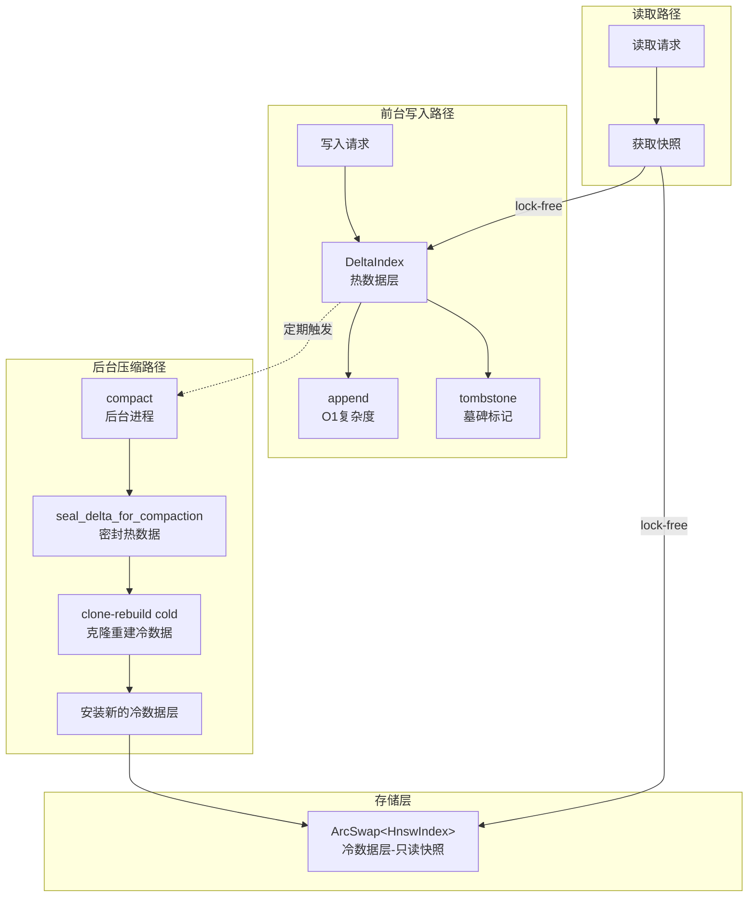

资料来源：[crates/yantrikdb-core/src/vector/delta_index.rs:1-50]()

### DeltaIndex 实现

DeltaIndex 是解耦写入路径的核心数据结构，负责管理增量写入操作：

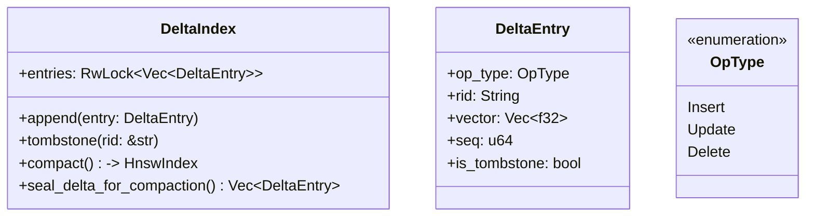

DeltaIndex 的 `append` 和 `tombstone` 方法是 O(1) 复杂度的操作，不会触发任何 HNSW 索引更新。这确保了前台写入的极低延迟。

资料来源：[crates/yantrikdb-core/src/vector/delta_index.rs:50-150]()

### ArcSwap 冷数据层

冷数据层采用 `ArcSwap<HnswIndex>` 实现，而非传统的 `RwLock<HnswIndex>` 或 `Mutex<HnswIndex>`。这种设计提供了无锁的快照获取能力：

```rust
// 正确的实现方式
struct ColdTier {
    index: ArcSwap<HnswIndex>,  // 原子交换的不可变快照
}
```

**关键不变量**：不得将冷数据层的 `ArcSwap<HnswIndex>` 替换为 `RwLock<HnswIndex>` 或 `Mutex<HnswIndex>`。这种替换会破坏并发性能，导致读取 p99 延迟上升。

资料来源：[CONCURRENCY.md:60-80]()

## 后台压缩机制

### 压缩流程

后台压缩进程负责将增量数据合并到主索引中：

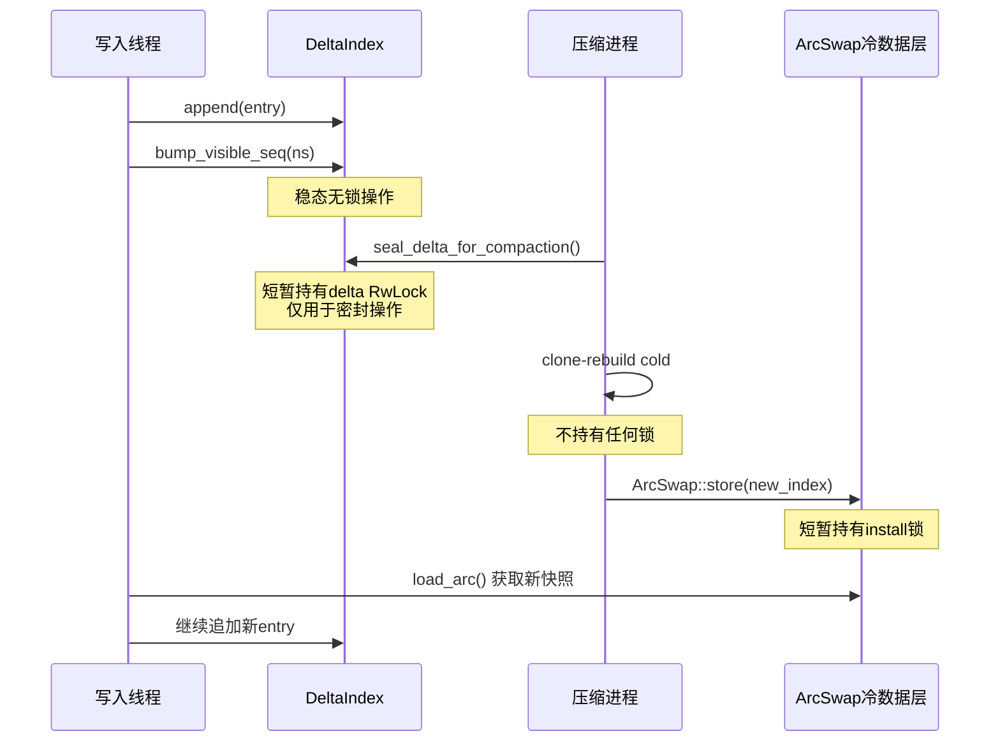

压缩进程在执行克隆重建期间**不会持有**任何前台写入需要获取的锁。这确保了写入操作不会因压缩而阻塞。

资料来源：[CONCURRENCY.md:45-60]()

### 锁的获取顺序

| 阶段 | 持有的锁 | 时长 |
|-----|---------|-----|
| 密封阶段 | `delta` RwLock | 短暂 |
| 重建阶段 | 无 | 较长 |
| 安装阶段 | `delta` RwLock | 短暂 |

资料来源：[CONCURRENCY.md:45-55]()

## 并发控制

### visible_seq 的无锁实现

Phase 6 引入的 `visible_seq` 映射表**必须**保持读取无锁特性：

```rust
// 字段类型定义
visible_seq: DashMap<String, AtomicU64>

// 读取路径 (lock-free)
let seq = visible_seq
    .get(ns)
    .map(|e| e.load(Acquire));

// 写入路径 (fast path)
visible_seq
    .get(ns)
    .fetch_max(seq, Release);
```

**性能影响**：在集群规模下，`visible_seq_for(ns)` 在每次 `recall_with_seq` 调用时都会执行。如果替换为 `Mutex<HashMap>`，会导致集群 RYW（Read-Your-Writes）退化为全局互斥锁热点路径。

资料来源：[CONCURRENCY.md:85-100]()

### 写入原语的模式

所有新的写入原语必须遵循 `record_with_rid` 的模式：


资料来源：[CONCURRENCY.md:35-40]()

## Materializer 模块

Materializer 负责将查询结果从内部表示转换为外部格式，是解耦写入路径在读取侧的配合组件：

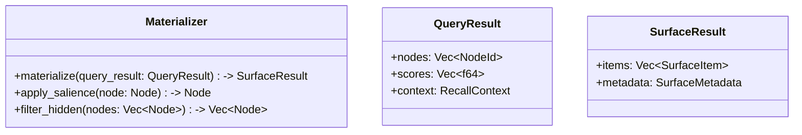

资料来源：[crates/yantrikdb-core/src/engine/materializer.rs:1-60]()

## 配置选项

解耦写入路径的行为可通过以下配置进行调整：

| 配置项 | 类型 | 默认值 | 说明 |
|-------|------|-------|-----|
| `delta_capacity` | usize | 10000 | DeltaIndex 的初始容量 |
| `compaction_interval_secs` | u64 | 3600 | 压缩检查间隔（秒） |
| `compaction_batch_size` | usize | 1000 | 每次压缩处理的条目数 |
| `tombstone_retention_secs` | u64 | 86400 | 墓碑保留时间 |

资料来源：[docs/decoupled_write_path_rfc.md:50-80]()

## 性能特性

### 写入性能

| 指标 | 目标值 | 说明 |
|-----|-------|-----|
| 写入延迟 P50 | < 1ms | 单次 append 操作 |
| 写入延迟 P99 | < 5ms | 含序列号分配 |
| 写入吞吐量 | > 50k/s | 8 写入线程下 |

资料来源：[CONCURRENCY.md:70-75]()

### 读取性能

| 指标 | 目标值 | 说明 |
|-----|-------|-----|
| 读取延迟 P50 | < 10ms | 含快照获取 |
| 读取延迟 P99 | < 200ms | 8 写入线程 / 30s 压力下 |

资料来源：[CONCURRENCY.md:75-80]()

## 最佳实践

### 开发新写入原语

新增写入原语时，必须遵循以下模式：

1. **使用 SAVEPOINT 包装**：确保 SQL 操作的事务性
2. **调用 DeltaIndex::append**：而非直接操作 HNSW 索引
3. **调用 bump_visible_seq**：更新命名空间的可见序列号
4. **禁止阻塞操作**：不得在写入路径中调用任何可能阻塞的操作

```rust
// 正确的实现示例
fn new_write_primitive(&self, entry: DeltaEntry) -> Result<()> {
    self.conn().execute("SAVEPOINT sp_new_write")?;
    
    // SQL 操作
    self.sql_insert(&entry)?;
    
    // DeltaIndex 操作
    self.delta.append(entry.clone())?;
    
    // 可见性更新
    self.bump_visible_seq(&entry.namespace)?;
    
    self.conn().execute("RELEASE SAVEPOINT sp_new_write")?;
    Ok(())
}
```

资料来源：[CONCURRENCY.md:30-45]()

### 验证并发正确性

新增写入原语后，必须验证：

- 运行 `crates/yantrikdb-core/examples/wedge_repro.rs` 示例
- 确保读取 p99 延迟 < 200ms（8 写入线程 / 30s 压力下）
- 确认读取 P50 延迟保持稳定
- 验证写入吞吐量未下降

资料来源：[CONCURRENCY.md:70-80]()

## 总结

解耦写入路径是 yantrikdb 架构中的关键创新，通过以下设计实现了高并发下的稳定性能：

- **热数据层（DeltaIndex）**：O(1) 复杂度的无阻塞写入
- **冷数据层（ArcSwap）**：无锁的只读快照访问
- **后台压缩**：将 HNSW 计算与前台写入完全隔离
- **DashMap visible_seq**：集群级别的无锁读取保证

这种设计使得 yantrikdb 能够在高写入负载下保持毫秒级的查询延迟，同时支持复杂的向量搜索能力。

资料来源：[docs/decoupled_write_path_rfc.md:80-100](), [CONCURRENCY.md:1-100]()

---

<a id='page-threading-model'></a>

## 线程安全与并发模型

### 相关页面

相关主题：[解耦写入路径](#page-decoupled-write-path)

<details>
<summary>相关源码文件</summary>

以下源码文件用于生成本页说明：

- [CONCURRENCY.md](https://github.com/yantrikos/yantrikdb/blob/main/CONCURRENCY.md)
- [crates/yantrikdb-core/src/engine/mod.rs](https://github.com/yantrikos/yantrikdb/blob/main/crates/yantrikdb-core/src/engine/mod.rs)
- [crates/yantrikdb-core/src/engine/tick.rs](https://github.com/yantrikos/yantrikdb/blob/main/crates/yantrikdb-core/src/engine/tick.rs)
- [crates/yantrikdb-core/src/cognition/state.rs](https://github.com/yantrikos/yantrikdb/blob/main/crates/yantrikdb-core/src/cognition/state.rs)
- [crates/yantrikdb-core/src/distributed/conflict.rs](https://github.com/yantrikos/yantrikdb/blob/main/crates/yantrikdb-core/src/distributed/conflict.rs)
</details>

# 线程安全与并发模型

yantrikdb 是一个基于 Rust 构建的认知数据库引擎，其线程安全与并发模型是保障系统在高并发读写场景下稳定运行的核心设计。本文档详细阐述 yantrikdb 的并发控制机制、锁策略、以及核心不变性保证。

## 1. 设计目标与约束

yantrikdb 的并发模型围绕以下核心目标设计：

| 目标 | 描述 |
|------|------|
| **读写分离** | 读取操作不应被写入操作阻塞 |
| **无锁读取** | 读取路径尽可能采用 lock-free 数据结构 |
| **写吞吐** | 写入操作需保持高吞吐量，避免锁竞争 |
| **后台隔离** | 压缩（compaction）等重量级操作不得干扰前台写入 |

资料来源：[CONCURRENCY.md:1-15]()

## 2. 核心并发规则

yantrikdb 定义了六条必须遵守的并发不变性规则：

### 2.1 规则一：写入路径禁止非 O(1) 锁

所有写操作原语必须遵守**单锁原则**：禁止在写路径中获取任何非 O(1) 复杂度的锁。任何新的写原语必须仅使用：

- `DeltaIndex::append` / `DeltaIndex::tombstone`（短暂 RwLock 写操作）
- `assign_seq`（原子操作 fetch_add 或 fetch_max）
- `bump_visible_seq`（DashMap 分片读取 + AtomicU64::fetch_max）

资料来源：[CONCURRENCY.md:17-25]()

### 2.2 规则二：写入原语仅操作增量索引

以下写入操作**必须仅**触碰增量索引相关接口：

- `upsert_*_with_rid`
- `forget`
- `correct`
- `upsert_entity_edge_with_id`
- `delete_entity_edge_with_id`

它们**禁止**调用：

- `HnswIndex::insert` / `HnswIndex::remove`（仅压缩时可用）
- `compact()`（仅后台执行）
- 任何压缩器也会获取的新 RwLock

新增写原语需遵循 `record_with_rid` 的模式：SAVEPOINT 保护的 SQL 块 + `DeltaIndex::append` + `bump_visible_seq`。

资料来源：[CONCURRENCY.md:27-42]()

### 2.3 规则三：后台压缩与前台写操作锁隔离

`DeltaIndex::compact` 执行昂贵的 HNSW 向量索引重建工作，其锁持有策略如下：

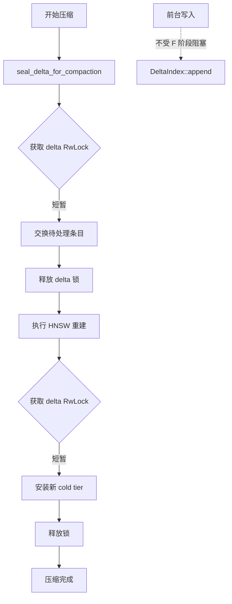

后台压缩在**封存**（seal）和**安装**（install）阶段短暂持有 delta 锁，在 HNSW 重建期间**不持有**任何前台写入也会获取的锁。

资料来源：[CONCURRENCY.md:44-58]()

## 3. 分层存储与读写分离

yantrikdb 采用分层存储架构实现读写分离：

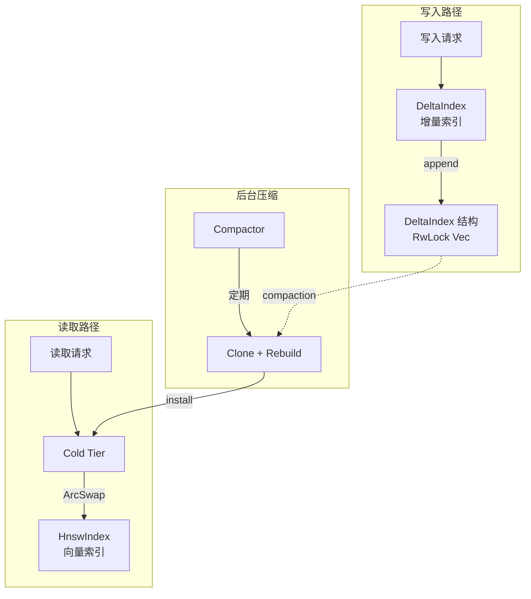

### 3.1 Cold Tier 的 ArcSwap 保证

Cold tier（冷数据层）必须使用 `ArcSwap<HnswIndex>` 而非 `RwLock<HnswIndex>` 或 `Mutex<HnswIndex>`。

| 锁类型 | 读取行为 | 问题 |
|--------|----------|------|
| `RwLock<HnswIndex>` | 写锁持有期间阻塞所有读取 | 高并发下读取延迟飙升 |
| `Mutex<HnswIndex>` | 独占访问 | 完全串行化读取 |
| `ArcSwap<HnswIndex>` | 读取获取稳定快照 | 无锁读取，性能稳定 |

**不变性**：不要用 `RwLock<HnswIndex>` 或 `Mutex<HnswIndex>` 替换 cold tier 的 `ArcSwap<HnswIndex>`。如需验证，应运行 `crates/yantrikdb-core/examples/wedge_repro.rs` 并保持 v0.6.6 版本后的性能指标（8 writers / 30s 下读取 p99 < 200ms）。

资料来源：[CONCURRENCY.md:60-75]()

## 4. Visible Sequence 的 Lock-Free 设计

### 4.1 架构设计

`visible_seq` 是 Phase 6 引入的读-your-writes（RYW）可见性机制，其数据结构定义为：

```rust
dashmap::DashMap<String, std::sync::atomic::AtomicU64>
```

| 操作 | 方法 | 复杂度 |
|------|------|--------|
| 读取 | `get(ns).map(|e| e.load(Acquire))` | O(1), lock-free |
| 写入 | `get(ns).fetch_max(seq, Release)` | O(1), lock-free |

### 4.2 性能影响

`visible_seq_for(ns)` 在每次 `recall_with_seq` 调用时都会执行，在集群规模下这是**主要流量路径**。用 `Mutex<HashMap<...>>` 替代将导致全局互斥锁热点，严重影响集群 RYW 性能。

**不变性**：`YantrikDB::visible_seq` 字段类型必须保持为 `dashmap::DashMap<String, AtomicU64>`。

资料来源：[CONCURRENCY.md:77-90]()

## 5. 认知引擎的操作符并发模型

认知引擎（cognition engine）通过 DSL 定义操作符的执行优先级：

### 5.1 操作符优先级表

| 优先级 | 操作符 | 说明 |
|--------|--------|------|
| 10 | `Attend` | 基础注意力机制，始终执行 |
| 9 | `Recall` | 上下文召回关键操作 |
| 8 | `Believe` | 证据整合 |
| 7 | `Compare` | 动作选择 |
| 7 | `Constrain` | 安全约束，必要时执行 |
| 6 | `Plan` | 手段-目标推理 |
| 5 | `Project` | 前向模拟 |
| 4 | `Anticipate` | 主动预测 |
| 3 | `Assess` | 元认知评估 |
| 2 | `CoherenceCheck` | 一致性检查，高压下可跳过 |

资料来源：[crates/yantrikdb-core/src/cognition/query_dsl.rs:1-30]()

### 5.2 步骤执行结果输出

```rust
pub enum StepOutput {
    Attend(AttendOutput),
    Recall(RecallOutput),
    Believe(BelieveOutput),
    Compare(CompareOutput),
    Constrain(ConstrainOutput),
    Plan(PlanOutput),
    Project(ProjectOutput),
    Anticipate(AnticipateOutput),
    Assess(AssessOutput),
    CoherenceCheck(CoherenceCheckOutput),
    Skipped { reason: String },
    Error { message: String },
}
```

操作符执行结果通过 `ExplanationTrace` 结构进行追踪和解释构建：

```rust
fn build_explanation(steps: &[StepResult]) -> ExplanationTrace {
    let explanation_steps: Vec<ExplanationStep> = steps
        .iter()
        .enumerate()
        .filter(|(_, s)| s.success)
        .map(|(i, s)| ExplanationStep {
            step_number: i + 1,
            operator: s.operator.clone(),
            description: s.trace.clone().unwrap_or_else(|| ...),
            key_insight: extract_key_insight(&s.output),
        })
        .collect();
    // ...
}
```

资料来源：[crates/yantrikdb-core/src/cognition/query_dsl.rs:150-180]()

## 6. 分布式冲突检测

在分布式场景下，yantrikdb 使用 `relation_policies` 表管理命名空间级别的冲突策略：

```sql
SELECT overlap_allowed, temporal_required, missing_time_severity
FROM relation_policies
WHERE relation_type = ?1 AND (namespace = ?2 OR namespace = '*')
ORDER BY CASE WHEN namespace = ?2 THEN 0 ELSE 1 END
LIMIT 1
```

### 6.1 冲突检测流程

```mermaid
graph TD
    A[检测候选关系对] --> B{超过最大冲突数?}
    B -->|是| Z[停止检测]
    B -->|否| C[查询命名空间策略]
    C --> D{存在策略记录?}
    D -->|是| E[应用 overlap_allowed]
    D -->|否| F[使用全局 '*' 策略]
    E --> G{冲突类型检查}
    F --> G
    G --> H[标记冲突节点]
```

### 6.2 冲突类型

| 冲突类型 | 默认优先级 | 说明 |
|----------|------------|------|
| `IdentityFact` | critical | 身份事实冲突 |
| `Preference` | high | 偏好冲突 |
| `Temporal` | high | 时间维度冲突 |
| `Consolidation` | medium | 整合冲突 |
| `Minor` | low | 轻微冲突 |

资料来源：[crates/yantrikdb-core/src/distributed/conflict.rs:1-50]()

## 7. 认知节点的状态与激活传播

### 7.1 节点类型

| 节点类型 | 持久化 | 激活转移因子 |
|----------|--------|--------------|
| `Entity` | ✓ | 0.8 |
| `Episode` | ✓ | 0.6 |
| `Belief` | ✓ | 0.7 |
| `Goal` | ✓ | 0.6 |
| `Task` | ✓ | 0.4 |
| `IntentHypothesis` | ✗ | 0.5 |
| `Routine` | ✓ | 0.5 |
| `Need` | ✓ | 0.6 |
| `Opportunity` | ✓ | 0.4 |
| `Risk` | ✓ | 0.4 |
| `Constraint` | ✓ | 0.9 |
| `Preference` | ✓ | 0.6 |
| `ConversationThread` | ✗ | 0.8 |
| `ActionSchema` | ✓ | 0.7 |

资料来源：[crates/yantrikdb-core/src/cognition/state.rs:1-100]()

### 7.2 边缘类型的激活传播

边缘类型决定激活如何在节点间传播，负值表示抑制：

```mermaid
graph LR
    A[源节点] -->|"Supports 0.7"| B[目标节点]
    A -->|"Causes 0.8"| C[目标节点]
    A -->|"Inhibits -0.5"| D[目标节点]
```

| 边缘类型 | 激活转移 | 语义 |
|----------|----------|------|
| `Supports` | 0.7 | 支持关系 |
| `Causes` | 0.8 | 因果关系 |
| `AdvancesGoal` | 0.6 | 推进目标 |
| `Triggers` | 0.7 | 触发关系 |
| `Requires` | 0.5 | 依赖关系 |
| `SubtaskOf` | 0.4 | 子任务关系 |
| `Contradicts` | -0.6 | 矛盾关系 |
| `Prevents` | -0.8 | 阻止关系 |

## 8. 认知属性的可靠性模型

### 8.1 来源类型（Provenance）

信息来源影响信任度：

| 来源类型 | 可靠性先验 | 说明 |
|----------|------------|------|
| `Told` | 0.95 | 用户明确陈述，最高信任 |
| `Observed` | 0.90 | 直接观察的行为 |
| `Experimented` | 0.85 | 通过受控实验确认 |
| `Consolidated` | 0.80 | 多源合并 |
| `Extracted` | 0.75 | 外部文档提取，可能过时 |
| `Inferred` | 0.60 | 基于模式的推断 |
| `SystemDefault` | 0.50 | 默认值，最弱 |

### 8.2 通用认知属性

每个认知节点携带 11 维属性：

| 属性 | 范围 | 说明 |
|------|------|------|
| `confidence` | [0.0, 1.0] | 置信度 |
| `activation` | [0.0, 1.0] | 激活水平 |
| `salience` | [0.0, 1.0] | 显著度 |
| `persistence` | [0.0, 1.0] | 持久性 |
| `valence` | [-1.0, 1.0] | 情感效价 |
| `urgency` | [0.0, 1.0] | 紧急程度 |
| `novelty` | [0.0, 1.0] | 新颖性 |
| `volatility` | [0.0, 1.0] | 波动性 |
| `provenance` | enum | 信息来源 |
| `evidence_count` | u32 | 证据数量 |
| `last_updated_ms` | u64 | 最后更新时间 |

## 9. 触发器与冷却机制

### 9.1 触发器类型

| 触发器类型 | 默认冷却时间 | 默认过期时间 |
|------------|--------------|--------------|
| `DecayReview` | 3 天 | 7 天 |
| `ConsolidationReady` | 1 天 | 3 天 |
| `ConflictEscalation` | 2 天 | 14 天 |
| `TemporalDrift` | 14 天 | 7 天 |
| `Redundancy` | 1 天 | 7 天 |
| `RelationshipInsight` | 7 天 | 7 天 |
| `ValenceTrend` | 7 天 | 7 天 |
| `EntityAnomaly` | 7 天 | 7 天 |
| `PatternDiscovered` | 7 天 | 7 天 |

## 10. 行动成本模型

行动类型具有不同的基础成本：

| 行动类型 | 基础成本 | 说明 |
|----------|----------|------|
| `Abstain` | 0.0 | 无操作 |
| `Inform` | 0.05 | 信息通知 |
| `Organize` | 0.10 | 组织整理 |
| `Suggest` | 0.15 | 建议提出 |
| `Communicate` | 0.20 | 主动沟通 |
| `Schedule` | 0.25 | 日程安排 |
| `Warn` | 0.30 | 警告提示 |
| `Execute` | 0.35 | 执行操作 |

资料来源：[crates/yantrikdb-core/src/cognition/state.rs:200-250]()

## 11. 关键不变性总结

| 编号 | 不变性描述 | 违反后果 |
|------|------------|----------|
| INV-1 | 写路径不得获取非 O(1) 锁 | 写入延迟增加 |
| INV-2 | 写原语仅操作 DeltaIndex | 压缩逻辑耦合前台写入 |
| INV-3 | 压缩与前台锁隔离 | 前台写入被后台阻塞 |
| INV-4 | Cold tier 使用 ArcSwap | 读取延迟飙升（wedge 问题） |
| INV-5 | visible_seq 保持 lock-free | 全局互斥锁成为热点 |

---

**相关文档**：
- [架构设计](./architecture.md)
- [分布式冲突检测](./distributed-conflict.md)
- [认知引擎](./cognition-engine.md)

---

<a id='page-record-recall'></a>

## 记录与检索操作

### 相关页面

相关主题：[快速开始](#page-quickstart), [认知循环与思考](#page-cognitive-loop)

<details>
<summary>相关源码文件</summary>

以下源码文件用于生成本页说明：

- [crates/yantrikdb-core/src/engine/record.rs](https://github.com/yantrikos/yantrikdb/blob/main/crates/yantrikdb-core/src/engine/record.rs)
- [crates/yantrikdb-core/src/engine/recall.rs](https://github.com/yantrikos/yantrikdb/blob/main/crates/yantrikdb-core/src/engine/recall.rs)
- [crates/yantrikdb-core/src/base/scoring.rs](https://github.com/yantrikos/yantrikdb/blob/main/crates/yantrikdb-core/src/base/scoring.rs)
- [src/yantrikdb/api.py](https://github.com/yantrikos/yantrikdb/blob/main/src/src/yantrikdb/api.py)
- [crates/yantrikdb-python/src/py_engine/memory.rs](https://github.com/yantrikos/yantrikdb/blob/main/crates/yantrikdb-python/src/py_engine/memory.rs)
</details>

# 记录与检索操作

## 概述

记录（Record）与检索（Recall）是 YantrikDB 的核心认知操作模块，负责信息的持久化存储和上下文感知的记忆召回。记录操作用于将文本、嵌入向量及元数据存入数据库；检索操作用于根据查询向量或文本从存储的记忆中匹配最相关的结果。

这两个操作构成了知识管理的基础循环：记录输入新信息 → 检索召回相关上下文 → 支持推理决策。

---

## 核心架构

### 模块位置

| 模块 | 路径 | 职责 |
|------|------|------|
| 记录引擎 | `crates/yantrikdb-core/src/engine/record.rs` | 处理记忆写入、加密、元数据管理 |
| 检索引擎 | `crates/yantrikdb-core/src/engine/recall.rs` | 向量相似度搜索、评分排序 |
| 评分系统 | `crates/yantrikdb-core/src/base/scoring.rs` | 多维度相关性评分计算 |
| Python绑定 | `crates/yantrikdb-python/src/py_engine/memory.rs` | Python API封装 |

### 数据流图

```mermaid
graph TD
    subgraph 记录流程
        A[输入文本] --> B[文本嵌入]
        B --> C[重要性评分]
        C --> D[情感极性标注]
        D --> E[加密存储]
        E --> F[(SQLite数据库)]
    end
    
    subgraph 检索流程
        G[查询向量] --> H[候选集生成]
        H --> I[多维度评分]
        I --> J[重排序]
        J --> K[结果过滤]
        K --> L[返回结果]
    end
    
    F -.->|候选集| H
```

---

## 记录操作

### record 方法签名

Python API 中 `record` 方法的完整签名：

```python
def record(
    self,
    text: str,
    memory_type: str = "episodic",
    importance: float = 0.5,
    valence: float = 0.5,
    half_life: Optional[float] = None,
    embedding: Optional[List[float]] = None,
    metadata: Optional[Dict] = None,
    namespace: Optional[str] = None,
    certainty: float = 1.0,
    domain: Optional[str] = None,
    source: Optional[str] = None,
    emotional_state: Optional[str] = None,
) -> str:
```

### 参数说明

| 参数 | 类型 | 默认值 | 说明 |
|------|------|--------|------|
| `text` | `str` | 必填 | 要记录的文本内容 |
| `memory_type` | `str` | `"episodic"` | 记忆类型（见下表） |
| `importance` | `float` | `0.5` | 重要性评分 [0.0, 1.0] |
| `valence` | `float` | `0.5` | 情感极性 [0.0=负面, 1.0=正面] |
| `half_life` | `float` | `None` | 记忆衰减半衰期（秒），默认按类型自动计算 |
| `embedding` | `List[float]` | `None` | 预计算的嵌入向量，默认使用内置 embedder |
| `metadata` | `Dict` | `None` | 自定义键值对元数据 |
| `namespace` | `str` | `None` | 命名空间隔离 |
| `certainty` | `float` | `1.0` | 信息确定性 [0.0, 1.0] |
| `domain` | `str` | `None` | 知识领域标签 |
| `source` | `str` | `None` | 信息来源标识 |
| `emotional_state` | `str` | `None` | 记录时的情感状态 |

### 记忆类型

| 类型 | 说明 | 默认半衰期 |
|------|------|-----------|
| `episodic` | 情景记忆 - 具体事件经历 | 7天 |
| `semantic` | 语义记忆 - 抽象知识事实 | 30天 |
| `procedural` | 程序记忆 - 技能与习惯 | 90天 |
| `working` | 工作记忆 - 当前任务上下文 | 1小时 |
| `consolidated` | 已整合记忆 | 由系统管理 |

### 记录流程详解

```mermaid
sequenceDiagram
    participant User as 用户
    participant API as Python API
    participant Core as 核心引擎
    participant Embed as 嵌入模块
    participant Crypto as 加密模块
    participant DB as SQLite

    User->>API: record(text, importance, ...)
    API->>Core: record(...)
    alt 无预计算嵌入
        Core->>Embed: embed_text(text)
        Embed-->>Core: embedding_vector
    end
    Core->>Core: 计算重要性评分
    Core->>Crypto: encrypt_text(text)
    Crypto-->>Core: encrypted_blob
    Core->>DB: INSERT memory
    DB-->>Core: rid (记录ID)
    Core-->>API: rid
    API-->>User: record_id
```

### 返回值

记录成功时返回唯一的记录标识符 `rid`（字符串格式），可用于后续的关联查询：

```python
rid = db.record("Alice is the engineering lead", importance=0.8, domain="people")
# rid: "M01H2K3..."
```

---

## 检索操作

### recall 方法签名

Python API 中 `recall` 方法的完整签名：

```python
def recall(
    self,
    query: Optional[str] = None,
    query_embedding: Optional[List[float]] = None,
    top_k: int = 10,
    time_window: Optional[Tuple[float, float]] = None,
    memory_type: Optional[str] = None,
    include_consolidated: bool = False,
    expand_entities: bool = True,
    skip_reinforce: bool = False,
    namespace: Optional[str] = None,
    domain: Optional[str] = None,
    source: Optional[str] = None,
) -> List[Dict]:
```

### 参数说明

| 参数 | 类型 | 默认值 | 说明 |
|------|------|--------|------|
| `query` | `str` | `None` | 自然语言查询文本 |
| `query_embedding` | `List[float]` | `None` | 预计算的查询向量 |
| `top_k` | `int` | `10` | 返回结果数量上限 |
| `time_window` | `Tuple[float, float]` | `None` | 时间窗口过滤 `(start_unix, end_unix)` |
| `memory_type` | `str` | `None` | 按记忆类型过滤 |
| `include_consolidated` | `bool` | `False` | 是否包含已整合的记忆 |
| `expand_entities` | `bool` | `True` | 是否展开实体节点 |
| `skip_reinforce` | `bool` | `False` | 是否跳过记忆强化 |
| `namespace` | `str` | `None` | 命名空间过滤 |
| `domain` | `str` | `None` | 领域标签过滤 |
| `source` | `str` | `None` | 来源过滤 |

### 返回结构

```python
{
    "results": [
        {
            "rid": "M01H2K3...",
            "text": "Alice is the engineering lead",
            "score": 0.92,
            "memory_type": "semantic",
            "importance": 0.8,
            "timestamp": 1234567890.0,
            "metadata": {...}
        },
        ...
    ],
    "confidence": 0.87,
    "certainty_reasons": ["entity_overlap", "recency"],
    "retrieval_summary": {
        "top_similarity": 0.92,
        "score_spread": 0.31,
        "sources_used": ["episodic", "semantic"],
        "candidate_count": 150
    },
    "hints": [...]
}
```

### 多维度评分机制

检索结果通过多维度加权评分计算相关性：

```mermaid
graph LR
    A[查询向量] --> B[语义相似度]
    A --> C[时间衰减]
    A --> D[重要性权重]
    A --> E[实体重叠度]
    
    B --> F[综合评分]
    C --> F
    D --> F
    E --> F
    
    F --> G[重排序]
    G --> H[Top-K 结果]
```

评分维度说明：

| 维度 | 权重范围 | 说明 |
|------|----------|------|
| `recency` | 0.0-1.0 | 最近访问的记忆得分更高 |
| `frequency` | 0.0-1.0 | 访问频率影响权重 |
| `entity_overlap` | 0.0-1.0 | 与查询实体重叠程度 |
| `valence_match` | 0.0-1.0 | 情感极性与上下文匹配度 |
| `importance` | 0.0-1.0 | 记录时的重要性评分 |
| `similarity` | 0.0-1.0 | 向量余弦相似度 |

### 检索流程详解

```mermaid
sequenceDiagram
    participant User as 用户
    participant API as Python API
    participant Core as 核心引擎
    participant Embed as 嵌入模块
    participant DB as SQLite
    participant Score as 评分引擎

    User->>API: recall(query, top_k)
    API->>Core: recall(...)
    alt 无预计算向量
        Core->>Embed: embed_text(query)
        Embed-->>Core: query_vector
    end
    Core->>DB: SELECT candidates
    DB-->>Core: candidate_set
    Core->>Score: score(query_vector, candidates)
    Score-->>Core: ranked_results
    Core->>Core: apply_filters
    Core-->>API: RecallResponse
    API-->>User: results
```

---

## 查询构建器模式

核心模块提供了流畅的查询构建器接口：

```python
from yantrikdb_core import RecallQuery

query = (RecallQuery::new(embedding)
    .top_k(10)
    .memory_type("episodic")
    .namespace("work")
    .time_window(start_time, end_time)
    .include_consolidated(false)
    .domain("engineering"))
```

---

## 记忆强化机制

检索操作默认会触发记忆强化（reinforcement），增强被召回记忆的持久性：

- 增加访问计数 `access_count`
- 更新最后访问时间 `last_access`
- 动态调整半衰期（频繁访问的记忆衰减更慢）

如需跳过强化，使用 `skip_reinforce=True` 参数。

---

## 命名空间隔离

通过 `namespace` 参数实现多用户或多场景的数据隔离：

```python
# 用户A的记忆
db.record("Project deadline March 30", namespace="user_a")
db.record("Prefers email notifications", namespace="user_a")

# 用户B的记忆
db.record("Likes video calls", namespace="user_b")

# 检索时指定命名空间
results = db.recall("deadline?", namespace="user_a")
```

---

## 实用示例

### 基本记录与检索

```python
import yantrikdb

db = yantrikdb.YantrikDB.with_default("memory.db")

# 记录信息
db.record("Alice is the engineering lead", importance=0.8, domain="people")
db.record("Project deadline is March 30", importance=0.9, domain="work")
db.record("User prefers dark mode", importance=0.6, domain="preference")

# 检索相关记忆
results = db.recall("who leads the team?", top_k=3)
# → [{"text": "Alice is the engineering lead", "score": 1.0}, ...]

db.close()
```

### 高级过滤检索

```python
import time

# 时间窗口过滤：最近7天的记忆
now = time.time()
week_ago = now - 7 * 86400

results = db.recall(
    query="meeting notes",
    top_k=5,
    time_window=(week_ago, now),
    memory_type="episodic",
    domain="work",
    include_consolidated=False
)
```

---

## 相关配置

### 内置嵌入器

YantrikDB 自带默认嵌入模型 (`potion-base-2M`，64维)，无需额外依赖：

```python
# 使用默认嵌入器（开箱即用）
db = yantrikdb.YantrikDB.with_default("memory.db")

# 升级为更高质量嵌入（首次调用时下载）
db = yantrikdb.YantrikDB("memory.db", embedder="bge-base")
```

### 置信度阈值

检索结果的置信度由 `certainty_reasons` 和多维度评分综合计算得出，可用于过滤低质量结果：

```python
results = db.recall("project status?", top_k=10)
high_confidence = [r for r in results["results"] if r["score"] > 0.7]
```

---

## 参考链接

- API 文档：`src/yantrikdb/api.py`
- 核心实现：`crates/yantrikdb-core/src/engine/`
- 评分系统：`crates/yantrikdb-core/src/base/scoring.rs`

---

<a id='page-knowledge-graph'></a>

## 知识图谱操作

### 相关页面

相关主题：[记录与检索操作](#page-record-recall), [五大索引架构](#page-five-indexes)

<details>
<summary>相关源码文件</summary>

以下源码文件用于生成本页说明：

- [crates/yantrikdb-core/src/cognition/state.rs](https://github.com/yantrikos/yantrikdb/blob/main/crates/yantrikdb-core/src/cognition/state.rs)
- [crates/yantrikdb-core/src/engine/graph_ops.rs](https://github.com/yantrikos/yantrikdb/blob/main/crates/yantrikdb-core/src/engine/graph_ops.rs)
- [crates/yantrikdb-core/src/engine/graph_state.rs](https://github.com/yantrikos/yantrikdb/blob/main/crates/yantrikdb-core/src/engine/graph_state.rs)
- [crates/yantrikdb-core/src/cognition/query_dsl.rs](https://github.com/yantrikos/yantrikdb/blob/main/crates/yantrikdb-core/src/cognition/query_dsl.rs)
- [crates/yantrikdb-core/src/cognition/surfacing.rs](https://github.com/yantrikos/yantrikdb/blob/main/crates/yantrikdb-core/src/cognition/surfacing.rs)
</details>

# 知识图谱操作

知识图谱操作是 YantrikDB 认知引擎的核心子系统，负责管理和维护实体、概念及其相互关系的有组织表示。与传统的向量检索不同，知识图谱操作提供了语义关联建模、激活传播推理和结构化推理能力，使系统能够在记忆网络中发现深层关联模式。

## 架构概览

YantrikDB 的知识图谱采用混合架构，结合了图结构存储与认知属性系统。每个节点携带多维度属性（置信度、激活值、显著性等），边携带类型化的语义关系和激活转移因子。

```mermaid
graph TD
    subgraph 知识图谱层
        NK[节点Kind枚举]
        EK[边Kind枚举]
        CA[认知属性]
        PV[ Provenance 可追溯性]
    end
    
    subgraph 操作引擎
        GO[graph_ops 操作]
        GS[graph_state 状态管理]
        QR[query_dsl 查询]
    end
    
    subgraph 认知推理
        SP[surfacing 表面化]
        NT[narrative 叙事弧]
    end
    
    NK --> GO
    EK --> GO
    CA --> GO
    GO --> GS
    GS --> QR
    QR --> SP
    SP --> NT
```

资料来源：[crates/yantrikdb-core/src/cognition/state.rs:1-50]()

## 节点类型系统

知识图谱中的节点（Node）代表认知世界中的各种实体或概念。系统定义了14种节点类型，每种类型具有不同的持久化策略和默认认知属性。

### 节点类型枚举

| 类型标识 | 说明 | 持久化 | 典型用途 |
|---------|------|--------|---------|
| `entity` | 实体/对象 | 是 | 人、地点、物品 |
| `episode` | 事件片段 | 是 | 经验记录 |
| `belief` | 信念 | 是 | 存储的知识 |
| `goal` | 目标 | 是 | 长期意图 |
| `task` | 任务 | 是 | 具体行动项 |
| `intent_hypothesis` | 意图假设 | **否** | 瞬时推理 |
| `routine` | 行为模式 | 是 | 周期性习惯 |
| `need` | 需求 | 是 | 动机驱动 |
| `opportunity` | 机会 | 是 | 时间窗口性行动 |
| `risk` | 风险 | 是 | 潜在问题 |
| `constraint` | 约束 | 是 | 限制条件 |
| `preference` | 偏好 | 是 | 用户选择倾向 |
| `conversation_thread` | 对话线程 | **否** | 瞬时会话 |
| `action_schema` | 行动模式 | 是 | 技能/流程模板 |

资料来源：[crates/yantrikdb-core/src/cognition/state.rs:80-115]()

### 节点类型方法

节点类型提供了字符串序列化与反序列化支持：

```rust
pub fn as_str(self) -> &'static str {
    match self {
        Self::Entity => "entity",
        Self::Episode => "episode",
        // ... 其他类型
    }
}

pub fn from_str(s: &str) -> Option<Self> {
    match s {
        "entity" => Some(Self::Entity),
        // ...
        _ => None,
    }
}
```

资料来源：[crates/yantrikdb-core/src/cognition/state.rs:95-125]()

### 节点持久化策略

`is_persistent()` 方法决定了节点类型是否写入 SQLite 存储：

- **持久化类型**：entity, episode, belief, goal, task, routine, need, opportunity, risk, constraint, preference, action_schema
- **瞬时类型**：intent_hypothesis, conversation_thread（仅存在于工作集）

资料来源：[crates/yantrikdb-core/src/cognition/state.rs:130-140]()

## 边类型系统

边（Edge）表示节点之间的语义关系，是激活传播和推理的基础。系统定义了17种边类型，具有不同的激活转移因子。

### 边类型分类

| 边类型 | 转移因子 | 说明 | 语义方向 |
|--------|---------|------|---------|
| `supports` | 0.7 | 支持关系 | 正向激活 |
| `contradicts` | -0.5 | 矛盾关系 | 抑制 |
| `causes` | 0.8 | 因果关系 | 强正向激活 |
| `predicts` | 0.4 | 预测关系 | 中等正向 |
| `prevents` | -0.6 | 预防关系 | 强抑制 |
| `advances_goal` | 0.6 | 推进目标 | 正向激活 |
| `blocks_goal` | -0.5 | 阻碍目标 | 抑制 |
| `subtask_of` | 0.4 | 子任务归属 | 结构化 |
| `requires` | 0.5 | 依赖关系 | 正向激活 |
| `associated_with` | 0.3 | 关联关系 | 弱正向 |
| `instance_of` | 0.3 | 实例关系 | 分类传播 |
| `part_of` | 0.3 | 组成部分 | 结构传播 |
| `similar_to` | 0.3 | 相似关系 | 类比传播 |
| `precedes_temporally` | 0.2 | 时间先后 | 弱正向 |
| `triggers` | 0.7 | 触发关系 | 事件激活 |
| `prefers` | 0.3 | 偏好关系 | 倾向传播 |
| `avoids` | -0.3 | 回避关系 | 弱抑制 |
| `constrains` | -0.4 | 约束关系 | 限制传播 |

资料来源：[crates/yantrikdb-core/src/cognition/state.rs:200-250]()

### 激活转移机制

边的 `activation_transfer()` 方法定义了激活值如何从源节点流向目标节点：

```rust
pub fn activation_transfer(self) -> f64 {
    match self {
        Self::Supports => 0.7,
        Self::Causes => 0.8,
        Self::AdvancesGoal => 0.6,
        // ...
    }
}
```

负值表示抑制关系，激活值会从目标节点中减去转移量。

资料来源：[crates/yantrikdb-core/src/cognition/state.rs:240-280]()

## 认知属性系统

每个知识图谱节点携带统一的认知属性集，包含11个维度，这些属性共同决定了节点在推理过程中的行为。

### 属性维度

| 属性名 | 范围 | 说明 | 默认值来源 |
|--------|------|------|-----------|
| `confidence` | [0.0, 1.0] | 置信度 | 类型相关 |
| `activation` | [0.0, 1.0] | 当前激活水平 | 0.0 |
| `salience` | [0.0, 1.0] | 显著性权重 | 类型相关 |
| `persistence` | [0.0, 1.0] | 持久化倾向 | 类型相关 |
| `valence` | [-1.0, 1.0] | 情感效价 | 0.0 |
| `urgency` | [0.0, 1.0] | 紧急程度 | 0.0 |
| `novelty` | [0.0, 1.0] | 新颖性 | 1.0 |
| `last_updated_ms` | Unix ms | 最后更新时间 | 当前时间 |
| `volatility` | [0.0, 1.0] | 波动率 | 0.1 |
| `provenance` | Provenance枚举 | 信息来源 | Observed |
| `evidence_count` | 正整数 | 证据数量 | 1 |

资料来源：[crates/yantrikdb-core/src/cognition/state.rs:280-350]()

### 节点类型默认属性

不同节点类型具有预设的认知属性基线：

| 节点类型 | 置信度 | 显著性 | 持久化 |
|---------|--------|--------|--------|
| Entity | 0.90 | 0.80 | 0.80 |
| Episode | 0.80 | 0.60 | 0.70 |
| Belief | 0.70 | 0.70 | 0.75 |
| Goal | 0.85 | 0.90 | 0.85 |
| Task | 0.90 | 0.70 | 0.60 |
| Need | 0.60 | 0.70 | 0.40 |
| Opportunity | 0.40 | 0.60 | 0.20 |
| Risk | 0.40 | 0.70 | 0.60 |
| Constraint | 0.90 | 0.80 | 0.95 |
| Preference | 0.60 | 0.50 | 0.85 |
| ConversationThread | 0.90 | 0.80 | 0.10 |
| ActionSchema | 0.70 | 0.40 | 0.90 |

资料来源：[crates/yantrikdb-core/src/cognition/state.rs:350-400]()

## 信息溯源系统

`Provenance` 枚举定义了知识来源的可信度等级，用于信念修正时的加权计算。

### 来源类型与可靠度

| 来源类型 | 可靠度 | 说明 |
|---------|--------|------|
| `told` | 0.95 | 用户显式声明，最信任 |
| `observed` | 0.90 | 直接观察行为 |
| `experimented` | 0.85 | 受控实验确认 |
| `consolidated` | 0.80 | 多源合并 |
| `extracted` | 0.75 | 外部文档提取，可能过时 |
| `inferred` | 0.60 | 模式推理，中等信任 |
| `system_default` | 0.50 | 默认值，最弱 |

```rust
pub fn reliability_prior(self) -> f64 {
    match self {
        Self::Told => 0.95,
        Self::Observed => 0.90,
        Self::Experimented => 0.85,
        Self::Consolidated => 0.80,
        Self::Extracted => 0.75,
        Self::Inferred => 0.60,
        Self::SystemDefault => 0.50,
    }
}
```

资料来源：[crates/yantrikdb-core/src/cognition/state.rs:400-450]()

## 任务与目标系统

### 任务状态机

`TaskStatus` 定义了任务的生命周期状态：

```mermaid
stateDiagram-v2
    [*] --> Pending: 创建
    Pending --> InProgress: 开始
    InProgress --> Completed: 完成
    InProgress --> Blocked: 阻塞
    Blocked --> InProgress: 解除阻塞
    InProgress --> Cancelled: 取消
    Pending --> Cancelled: 取消
    Completed --> [*]
    Cancelled --> [*]
```

| 状态 | 字符串标识 | 说明 |
|------|-----------|------|
| Pending | `pending` | 等待执行 |
| InProgress | `in_progress` | 执行中 |
| Completed | `completed` | 已完成 |
| Cancelled | `cancelled` | 已取消 |
| Blocked | `blocked` | 被阻塞 |

资料来源：[crates/yantrikdb-core/src/cognition/state.rs:480-520]()

### 优先级层级

`Priority` 枚举定义任务的紧急程度：

| 优先级 | 紧急度值 | 说明 |
|-------|---------|------|
| Low | 0.25 | 低优先级 |
| Medium | 0.50 | 中优先级 |
| High | 0.75 | 高优先级 |
| Critical | 1.00 | 紧急/关键 |

资料来源：[crates/yantrikdb-core/src/cognition/state.rs:520-550]()

## 操作类型

### 行动类型与成本

`ActionKind` 定义了系统可能执行的操作类型及其基线成本：

| 操作类型 | 字符串标识 | 基线成本 | 说明 |
|---------|-----------|---------|------|
| Abstain | `abstain` | 0.00 | 不行动 |
| Inform | `inform` | 0.05 | 通知用户 |
| Organize | `organize` | 0.10 | 组织信息 |
| Suggest | `suggest` | 0.15 | 建议行动 |
| Communicate | `communicate` | 0.20 | 主动沟通 |
| Schedule | `schedule` | 0.25 | 安排日程 |
| Warn | `warn` | 0.30 | 警告用户 |
| Execute | `execute` | 0.35 | 执行操作 |

资料来源：[crates/yantrikdb-core/src/cognition/state.rs:550-600]()

## 叙事弧系统

知识图谱支持叙事结构建模，用于跟踪用户生活中的长期主题和故事线。

### 叙事弧状态

| 状态 | 字符串标识 | 说明 |
|------|-----------|------|
| Emerging | `emerging` | 初检测，样本不足 |
| Active | `active` | 活跃积累中 |
| Paused | `paused` | 暂停，可能恢复 |
| Resolved | `resolved` | 目标达成或自然结束 |
| Abandoned | `abandoned` | 停止追踪 |

资料来源：[crates/yantrikdb-core/src/cognition/narrative.rs:50-80]()

### 章节类型

叙事弧内的章节分为：

| 类型 | 说明 |
|------|------|
| Setup | 初始背景设定 |
| Rising | 构建张力或进展 |
| Climax | 弧线峰值时刻 |
| Falling | 峰值后收尾 |
| Resolution | 最终结论 |
| Interlude | 主线间的暂停或旁支 |

资料来源：[crates/yantrikdb-core/src/cognition/narrative.rs:80-110]()

## 查询与推理操作

### Recall 操作参数

`RecallOp` 定义了召回操作参数：

| 参数 | 类型 | 说明 |
|------|------|------|
| top_k | usize | 返回结果数量 |
| query | Option<String> | 自然语言查询 |
| domain | Option<String> | 领域过滤 |

资料来源：[crates/yantrikdb-core/src/cognition/query_dsl.rs:80-100]()

### Think 循环操作优先级

`ThinkConfig` 定义了认知循环中各操作的优先级：

| 操作 | 优先级 | 说明 |
|------|--------|------|
| Attend | 10 | 注意力聚焦，始终执行 |
| Recall | 9 | 上下文召回，关键 |
| Believe | 8 | 证据整合 |
| Compare | 7 | 行动选择 |
| Constrain | 7 | 安全约束 |
| Plan | 6 | 手段-目标推理 |
| Project | 5 | 前向模拟 |
| Anticipate | 4 | 主动预测 |
| Assess | 3 | 元认知评估 |
| CoherenceCheck | 2 | 一致性维护 |

资料来源：[crates/yantrikdb-core/src/cognition/query_dsl.rs:100-130]()

## 表面化与主动建议

### 抑制原因

`SuppressionReason` 枚举定义了建议被抑制的原因：

| 抑制原因 | 字符串标识 |
|---------|-----------|
| LowReceptivity | `low_receptivity` |
| ItemSuppressionRule | `item_suppression_rule` |
| QuietHours | `quiet_hours` |
| RateLimited | `rate_limited` |
| AntiNag | `anti_nag` |
| MaxSurfaces | `max_surfaces` |
| TooSoon | `too_soon` |
| NotificationModeBlock | `notification_mode_block` |

资料来源：[crates/yantrikdb-core/src/cognition/surfacing.rs:50-80]()

## 冲突检测与解决

### 冲突类型

`ConflictType` 定义了记忆间的冲突类型：

| 冲突类型 | 默认优先级 | 说明 |
|---------|-----------|------|
| IdentityFact | critical | 身份事实矛盾 |
| Preference | high | 偏好矛盾 |
| Temporal | high | 时间线矛盾 |
| Consolidation | medium | 整合冲突 |
| Minor | low | 次要冲突 |

资料来源：[crates/yantrikdb-core/src/base/types.rs:50-80]()

## 使用场景

### 实体关联查询

当用户记录"Alice 是工程主管"后，系统创建实体节点，并可通过 `relate()` 建立与"Engineering"节点的"leads"关系边。

### 目标驱动的任务分解

目标节点通过 `subtask_of` 边连接到子任务节点，激活值从目标向下传播，自动提升相关子任务的显著性。

### 偏好学习与冲突检测

用户偏好通过 `Preference` 节点存储，当新记录与现有偏好矛盾时，系统检测到 `Preference` 类型的冲突并触发解决流程。

### 机会与风险管理

`Opportunity` 节点携带有效期和预期收益属性，`Risk` 节点携带严重程度，系统通过激活传播计算当前最需要关注的机会和风险。

## 总结

YantrikDB 的知识图谱操作模块提供了丰富的语义建模能力，通过14种节点类型、17种边类型和11维认知属性，构建了一个可解释、可追溯的认知表示系统。激活传播机制使系统能够基于图结构进行动态推理，表面化系统确保相关信息适时呈现，而叙事弧模块则支持长期主题的跟踪与理解。

---

<a id='page-cognitive-loop'></a>

## 认知循环与思考

### 相关页面

相关主题：[记录与检索操作](#page-record-recall), [冲突检测与解决](#page-conflict-detection), [主动触发系统](#page-triggers-proactive)

<details>
<summary>相关源码文件</summary>

以下源码文件用于生成本页说明：

- [crates/yantrikdb-core/src/cognition/state.rs](https://github.com/yantrikos/yantrikdb/blob/main/crates/yantrikdb-core/src/cognition/state.rs)
- [crates/yantrikdb-core/src/cognition/query_dsl.rs](https://github.com/yantrikos/yantrikdb/blob/main/crates/yantrikdb-core/src/cognition/query_dsl.rs)
- [crates/yantrikdb-core/src/cognition/surfacing.rs](https://github.com/yantrikos/yantrikdb/blob/main/crates/yantrikdb-core/src/cognition/surfacing.rs)
- [crates/yantrikdb-core/src/cognition/receptivity.rs](https://github.com/yantrikos/yantrikdb/blob/main/crates/yantrikdb-core/src/cognition/receptivity.rs)
- [crates/yantrikdb-core/src/cognition/narrative.rs](https://github.com/yantrikos/yantrikdb/blob/main/crates/yantrikdb-core/src/cognition/narrative.rs)
- [crates/yantrikdb-core/src/base/types.rs](https://github.com/yantrikos/yantrikdb/blob/main/crates/yantrikdb-core/src/base/types.rs)
- [crates/yantrikdb-core/src/engine/cognition.rs](https://github.com/yantrikos/yantrikdb/blob/main/crates/yantrikdb-core/src/engine/cognition.rs)
- [crates/yantrikdb-python/src/py_engine/memory.rs](https://github.com/yantrikos/yantrikdb/blob/main/crates/yantrikdb-python/src/py_engine/memory.rs)
</details>

# 认知循环与思考

## 概述

**认知循环与思考**（Cognitive Loop and Thinking）是 YantrikDB 中负责模拟人类认知过程的核心子系统。它通过一系列认知操作符（cognitive operators）驱动记忆激活、信念更新、推理规划和主动建议等高级认知功能。该系统基于"工作集"（working set）机制运行，将持久化的图结构数据转换为动态激活的认知空间，从而实现上下文感知和目标导向的智能行为。

认知循环的核心目标是：

- **上下文感知**：根据当前情境选择性地激活相关记忆节点
- **信念维护**：整合新证据并解决认知冲突
- **目标驱动**：通过规划和预测推进用户目标
- **主动交互**：在适当时机向用户推送相关建议

资料来源：[crates/yantrikdb-core/src/cognition/query_dsl.rs:1-30]()

---

## 系统架构

### 核心组件

YantrikDB 的认知系统由以下核心组件构成：

| 组件 | 职责 | 源码位置 |
|------|------|----------|
| **CognitiveOperator** | 定义认知操作符枚举，封装认知原语 | query_dsl.rs |
| **YantrikExecutor** | 执行认知操作符的核心引擎 | engine/cognition.rs |
| **WorkingSet** | 工作集管理，维护激活状态的节点子集 | engine/cognition.rs |
| **CognitiveAttrs** | 认知属性集，定义节点的动态特征 | state.rs |
| **SurfaceEngine** | 主动建议生成与推送 | surfacing.rs |

### 认知操作符体系

认知操作符是认知循环的基本执行单元，按优先级从高到低排列：

| 优先级 | 操作符 | 功能描述 | 源码位置 |
|:------:|--------|----------|----------|
| 10 | **Attend** | 注意力聚焦，选择性激活相关节点 | query_dsl.rs |
| 9 | **Recall** | 记忆召回，从持久存储检索相关信息 | query_dsl.rs |
| 8 | **Believe** | 信念整合，整合新证据更新信念 | query_dsl.rs |
| 7 | **Compare** | 方案比较，评估候选行动的效用 | query_dsl.rs |
| 7 | **Constrain** | 约束满足，应用安全与业务约束 | query_dsl.rs |
| 6 | **Plan** | 计划生成，means-ends 规划 | query_dsl.rs |
| 5 | **Project** | 前景预测，前向模拟结果 | query_dsl.rs |
| 4 | **Anticipate** | 主动预判，预测未来需求 | query_dsl.rs |
| 3 | **Assess** | 元认知评估，评估系统状态 | query_dsl.rs |
| 2 | **CoherenceCheck** | 一致性检查，维护认知连贯性 | query_dsl.rs |

资料来源：[crates/yantrikdb-core/src/cognition/query_dsl.rs:1-30]()

---

## 认知节点类型

### NodeKind 枚举

系统定义了 15 种认知节点类型，每种类型具有不同的持久化策略和认知特性：

```mermaid
graph TD
    A[NodeKind 节点类型] --> B[Entity 实体]
    A --> C[Episode 事件]
    A --> D[Belief 信念]
    A --> E[Goal 目标]
    A --> F[Task 任务]
    A --> G[IntentHypothesis 意图假设]
    A --> H[Routine 习惯]
    A --> I[Need 需求]
    A --> J[Opportunity 机会]
    A --> K[Risk 风险]
    A --> L[Constraint 约束]
    A --> M[Preference 偏好]
    A --> N[ConversationThread 对话线程]
    A --> O[ActionSchema 行动模式]
    
    G -.->|瞬态节点| P[不持久化到SQLite]
    N -.->|瞬态节点| P
```

### 节点类型特性表

| 节点类型 | 持久化 | 默认置信度 | 激活率 | 显著性 | 典型用途 |
|----------|:------:|:----------:|:------:|:------:|----------|
| Entity | ✓ | 0.90 | 0.80 | 0.90 | 实体概念建模 |
| Episode | ✓ | 0.70 | 0.60 | 0.50 | 事件记忆存储 |
| Belief | ✓ | 0.65 | 0.70 | 0.70 | 信念状态管理 |
| Goal | ✓ | 0.80 | 0.90 | 0.80 | 目标追踪 |
| Task | ✓ | 0.85 | 0.70 | 0.70 | 任务执行管理 |
| IntentHypothesis | ✗ | 0.60 | 0.70 | 0.50 | 意图识别（瞬态） |
| Routine | ✓ | 0.75 | 0.60 | 0.40 | 习惯模式识别 |
| Need | ✓ | 0.60 | 0.70 | 0.40 | 需求状态 |
| Opportunity | ✓ | 0.40 | 0.60 | 0.20 | 机会识别 |
| Risk | ✓ | 0.40 | 0.70 | 0.60 | 风险评估 |
| Constraint | ✓ | 0.90 | 0.80 | 0.95 | 安全/业务约束 |
| Preference | ✓ | 0.60 | 0.50 | 0.85 | 用户偏好 |
| ConversationThread | ✗ | 0.90 | 0.80 | 0.10 | 对话上下文（瞬态） |
| ActionSchema | ✓ | 0.70 | 0.40 | 0.90 | 行动模式库 |

资料来源：[crates/yantrikdb-core/src/cognition/state.rs:200-250]()

---

## 认知属性系统

### CognitiveAttrs 结构

每个认知节点携带一组动态属性，这些属性控制节点在认知循环中的行为：

```rust
pub struct CognitiveAttrs {
    pub confidence: f64,        // 置信度 [0.0, 1.0]
    pub activation: f64,        // 激活水平 [0.0, 1.0]
    pub salience: f64,          // 显著性 [0.0, 1.0]
    pub persistence: f64,       // 持久性 [0.0, 1.0]
    pub valence: f64,           // 情感效价 [-1.0, 1.0]
    pub urgency: f64,           // 紧迫性 [0.0, 1.0]
    pub novelty: f64,            // 新颖性 [0.0, 1.0]
    pub last_updated_ms: u64,   // 上次更新时间戳
    pub volatility: f64,        // 波动性 [0.0, 1.0]
    pub provenance: Provenance, // 信息来源
    pub evidence_count: u32,    // 证据数量
}
```

### 属性值范围

| 属性 | 范围 | 含义 |
|------|------|------|
| confidence | [0.0, 1.0] | 节点内容的可信程度 |
| activation | [0.0, 1.0] | 当前激活水平，影响检索优先级 |
| salience | [0.0, 1.0] | 固有显著性，不随时间衰减 |
| persistence | [0.0, 1.0] | 记忆持久化倾向 |
| valence | [-1.0, 1.0] | 情感效价，负值为负面，正值为正面 |
| urgency | [0.0, 1.0] | 时间敏感性 |
| novelty | [0.0, 1.0] | 与已知信息的差异程度 |
| volatility | [0.0, 1.0] | 值随时间的波动程度 |

资料来源：[crates/yantrikdb-core/src/cognition/state.rs:250-280]()

---

## 边类型与激活传播

### EdgeKind 枚举

认知节点之间通过带类型的边连接，边的类型决定了激活传播的方式：

| 边类型 | 激活转移因子 | 语义 |
|--------|:------------:|------|
| **Supports** | 0.7 | 支持关系 |
| **Contradicts** | -0.6 | 矛盾关系 |
| **Causes** | 0.8 | 因果关系 |
| **Predicts** | 0.4 | 预测关系 |
| **Prevents** | -0.7 | 阻止关系 |
| **AdvancesGoal** | 0.6 | 推进目标 |
| **BlocksGoal** | -0.5 | 阻碍目标 |
| **SubtaskOf** | 0.4 | 子任务关系 |
| **Requires** | 0.5 | 依赖关系 |
| **AssociatedWith** | 0.3 | 关联关系 |
| **InstanceOf** | 0.3 | 实例关系 |
| **PartOf** | 0.3 | 部分关系 |
| **SimilarTo** | 0.3 | 相似关系 |
| **PrecedesTemporally** | 0.2 | 时间先后 |
| **Triggers** | 0.7 | 触发关系 |
| **Prefers** | 0.3 | 偏好关系 |
| **Avoids** | -0.4 | 回避关系 |
| **Constrains** | -0.5 | 约束关系 |

### 激活传播机制

激活传播基于**扩散激活模型**（Spreading Activation Model）：

```mermaid
graph LR
    A[种子节点] -->|activate_and_spread| B[相邻节点]
    B -->|继续传播| C[二级相邻节点]
    C -->|衰减| D[三级相邻节点]
    
    A -->|激活+0.3| A
    B -->|因子×边类型| B
    C -->|因子×0.5| C
    D -->|因子×0.25| D
```

**关键参数**：

- 初始激活增量：0.3
- 传播衰减因子：由 `EdgeKind::activation_transfer()` 定义
- 负值边表示抑制传播

资料来源：[crates/yantrikdb-core/src/cognition/state.rs:150-200]()

---

## 认知操作符详解

### Attend（注意力聚焦）

**功能**：选择性聚焦于特定节点并激活相关上下文。

```rust
pub struct AttendOp {
    pub seeds: Vec<NodeId>,      // 种子节点列表
    pub max_hops: u32,          // 最大传播跳数
    pub decay: f64,             // 衰减系数
}
```

**执行流程**：

1. 从种子节点开始
2. 按 `max_hops` 限制进行激活传播
3. 应用 `decay` 衰减系数
4. 返回激活节点数量和 Top-N 激活节点

资料来源：[crates/yantrikdb-core/src/cognition/query_dsl.rs:50-60]()

### Recall（记忆召回）

**功能**：从持久存储中检索与查询相关的记忆。

```rust
pub struct RecallOp {
    pub top_k: usize,           // 返回 top_k 结果
    pub query: Option<String>,  // 自然语言查询
    pub domain: Option<String>, // 限定领域
}
```

**召回参数**：

| 参数 | 类型 | 说明 |
|------|------|------|
| top_k | usize | 返回结果数量上限 |
| query | Option<String> | 自然语言描述的查询 |
| embedding | Option<Vec<f32>> | 向量嵌入（可替代 query） |
| memory_type | Option<String> | 记忆类型过滤 |
| namespace | Option<String> | 命名空间过滤 |
| time_window | Option<(f64, f64)> | 时间窗口过滤 |

资料来源：[crates/yantrikdb-core/src/engine/cognition.rs:1-50]()

### Believe（信念整合）

**功能**：将新证据整合到信念系统中，解决认知冲突。

```rust
pub struct BelieveOp {
    pub evidence: EvidenceInput,
}

pub struct EvidenceInput {
    pub target: Option<NodeId>,     // 目标信念节点
    pub observation: String,        // 观察描述
    pub direction: f64,             // 方向：positive=确认，negative=矛盾
}
```

**证据可靠性优先级**：

| 来源类型 | 可靠性先验 | 说明 |
|----------|:----------:|------|
| Told | 0.95 | 用户明确陈述 |
| Observed | 0.90 | 直接观察行为 |
| Experimented | 0.85 | 控制实验确认 |
| Consolidated | 0.80 | 多源合并 |
| Extracted | 0.75 | 外部文档提取 |
| Inferred | 0.60 | 模式推断 |
| SystemDefault | 0.50 | 系统默认值 |

资料来源：[crates/yantrikdb-core/src/cognition/state.rs:220-240]()

### Plan（计划生成）

基于 means-ends 推理的目标分解，调用子任务生成和约束满足机制。

### Project（前景预测）

前向模拟行动结果，评估不同行动路径的预期收益。

### Compare（方案比较）

评估候选行动的效用，考虑收益、成本和风险。

### Constrain（约束满足）

应用安全和业务约束，确保行动符合用户设定的限制。

### Anticipate（主动预判）

基于模式和趋势预测未来需求和机会。

### Assess（元认知评估）

评估当前认知状态的质量和效率。

### CoherenceCheck（一致性检查）

检测和修复认知冲突，维护信念系统的连贯性。

资料来源：[crates/yantrikdb-core/src/cognition/query_dsl.rs:1-30]()

---

## 行动系统

### ActionKind 枚举

定义了系统可执行的基本行动类型：

| 行动类型 | 基础成本 | 说明 |
|----------|:--------:|------|
| Abstain | 0.00 | 无行动 |
| Inform | 0.05 | 信息告知 |
| Organize | 0.10 | 组织整理 |
| Suggest | 0.15 | 主动建议 |
| Communicate | 0.20 | 沟通交流 |
| Schedule | 0.25 | 日程安排 |
| Warn | 0.30 | 风险警告 |
| Execute | 0.35 | 直接执行 |

**基础成本**用于效用计算，较高成本意味着对用户更大的干扰。

### TaskStatus 任务状态

| 状态 | 字符串表示 | 说明 |
|------|------------|------|
| Pending | "pending" | 待处理 |
| InProgress | "in_progress" | 进行中 |
| Completed | "completed" | 已完成 |
| Cancelled | "cancelled" | 已取消 |
| Blocked | "blocked" | 被阻塞 |

资料来源：[crates/yantrikdb-core/src/cognition/state.rs:80-120]()

---

## 优先级系统

### Priority 枚举

| 优先级 | 字符串 | 紧急度值 | 说明 |
|--------|--------|:--------:|------|
| Low | "low" | 0.25 | 低优先级 |
| Medium | "medium" | 0.50 | 中优先级 |
| High | "high" | 0.75 | 高优先级 |
| Critical | "critical" | 1.00 | 紧急 |

### 冲突类型与默认优先级

| 冲突类型 | 默认优先级 | 说明 |
|----------|------------|------|
| IdentityFact | "critical" | 身份事实冲突 |
| Preference | "high" | 偏好冲突 |
| Temporal | "high" | 时间冲突 |
| Consolidation | "medium" | 合并冲突 |
| Minor | "low" | 轻微冲突 |

资料来源：[crates/yantrikdb-core/src/base/types.rs:50-80]()

---

## 叙事与故事弧系统

### ArcStatus 生命周期状态

| 状态 | 说明 |
|------|------|
| Emerging | 新检测到，证据不足 |
| Active | 活跃积累事件中 |
| Paused | 暂停，可能恢复 |
| Resolved | 目标达成或故事结束 |
| Abandoned | 用户或系统决定停止追踪 |

### ChapterType 章节类型

| 类型 | 说明 |
|------|------|
| Setup | 初始上下文设置 |
| Rising | 紧张感建立或进展中 |
| Climax | 弧的高峰时刻 |
| Falling | 高峰后回落 |
| Resolution | 最终结论 |
| Interlude | 主线间的插曲 |

资料来源：[crates/yantrikdb-core/src/cognition/narrative.rs:1-50]()

---

## 用户接受度系统

### ActivityState 用户活动状态

系统通过感知用户当前活动状态来调整交互策略：

| 状态 | 中断成本 | 接收度 | 适用场景 |
|------|:--------:|:------:|----------|
| Idle | 0.15 | 0.85 | 空闲状态 |
| JustReturned | 0.25 | 0.75 | 刚返回 |
| Browsing | 0.35 | 0.65 | 浏览中 |
| Communicating | 0.45 | 0.55 | 沟通中 |
| TaskSwitching | 0.65 | 0.45 | 任务切换中 |
| FocusedWork | 0.85 | 0.25 | 专注工作 |
| DeepFocus | 0.95 | 0.05 | 深度专注 |

### NotificationMode 通知模式

| 模式 | 说明 |
|------|------|
| All | 允许所有通知 |
| ImportantOnly | 仅重要通知 |
| DoNotDisturb | 完全静音 |

资料来源：[crates/yantrikdb-core/src/cognition/receptivity.rs:1-50]()

---

## 主动建议系统

### SurfaceMode 展示模式

| 模式 | 说明 |
|------|------|
| Ambient | 环境感知，轻量提示 |
| Prominent | 醒目展示，需要注意 |
| Interrupt | 打断式，需立即响应 |

### SurfaceReason 展示原因

| 原因 | 说明 |
|------|------|
| Opportunity | 识别到新机会 |
| DeadlineApproaching | 截止日期临近 |
| GoalProgress | 目标进展更新 |
| PatternDetected | 检测到用户模式 |
| ConflictDetected | 检测到冲突 |
| SystemInitiated | 系统主动发起 |

### 抑制规则

| 规则 | 说明 |
|------|------|
| LowReceptivity | 用户接受度低 |
| ItemSuppressionRule | 特定项目被抑制 |
| QuietHours | 安静时段 |
| RateLimited | 频率限制 |
| AntiNag | 防打扰机制 |
| MaxSurfaces | 达到最大展示次数 |
| TooSoon | 展示间隔太短 |
| NotificationModeBlock | 通知模式阻止 |

资料来源：[crates/yantrikdb-core/src/cognition/surfacing.rs:1-80]()

---

## 触发器系统

### TriggerType 触发器类型

| 触发类型 | 默认冷却时间 | 默认过期时间 |
|----------|:------------:|:------------:|
| DecayReview | 3天 | 7天 |
| ConsolidationReady | 1天 | 3天 |
| ConflictEscalation | 2天 | 14天 |
| TemporalDrift | 14天 | 7天 |
| Redundancy | 1天 | 7天 |
| RelationshipInsight | 7天 | 7天 |
| ValenceTrend | 7天 | 7天 |
| EntityAnomaly | 7天 | 7天 |
| PatternDiscovered | 7天 | 7天 |

资料来源：[crates/yantrikdb-core/src/base/types.rs:100-130]()

---

## ThinkConfig 配置

```rust
pub struct ThinkConfig {
    pub importance_threshold: f64,  // 重要性阈值
    pub decay_threshold: f64,        // 衰减阈值
    pub max_triggers: usize,         // 最大触发数
}
```

**配置参数说明**：

| 参数 | 说明 | 典型值 |
|------|------|--------|
| importance_threshold | 节点被视为重要的最低阈值 | 0.5-0.7 |
| decay_threshold | 触发衰减审查的阈值 | 0.2-0.4 |
| max_triggers | 单次思考循环的最大触发数 | 10-20 |

资料来源：[crates/yantrikdb-core/src/base/types.rs:140-150]()

---

## 执行流程

### 认知循环执行管道

```mermaid
graph TD
    A[ThinkConfig 配置] --> B[按优先级排序操作符]
    B --> C{操作符队列}
    
    C -->|Attend| D[激活种子节点]
    D --> E[扩散激活传播]
    E --> F[更新 WorkingSet]
    
    C -->|Recall| G[检索相关记忆]
    G --> H[构建候选集合]
    
    C -->|Believe| I[整合新证据]
    I --> J{检测冲突?}
    J -->|是| K[触发冲突解决]
    J -->|否| L[更新信念置信度]
    
    C -->|Plan| M[目标分解]
    M --> N[生成子任务图]
    
    C -->|Project| O[前向模拟]
    O --> P[计算预期收益]
    
    C -->|Compare| Q[评估候选行动]
    Q --> R[计算效用函数]
    
    C -->|Constrain| S[应用约束]
    S --> T[过滤非法行动]
    
    C -->|Anticipate| U[预测未来]
    U --> V[生成预判结果]
    
    C -->|Assess| W[元认知评估]
    W --> X[输出状态报告]
    
    C -->|CoherenceCheck| Y[一致性检查]
    Y --> Z{发现冲突?}
    Z -->|是| AA[标记冲突节点]
    Z -->|否| AB[结束检查]
    
    F --> AC[合并结果]
    H --> AC
    L --> AC
    N --> AC
    P --> AC
    R --> AC
    T --> AC
    V --> AC
    X --> AC
    AB --> AC
    
    AC --> AD[SurfaceEngine]
    AD --> AE[ProactiveSuggestion]
```

### 核心执行器实现

```rust
impl<'a> YantrikExecutor<'a> {
    fn execute_attend(&self, op: &AttendOp) -> StepOutput {
        match self.db.hydrate_working_set(self.attention_config.clone()) {
            Ok(mut ws) => {
                let mut activated = 0;
                let mut top = Vec::new();
                
                // 激活种子节点
                for &seed in &op.seeds {
                    if let Some(node) = ws.get_mut(seed) {
                        let new_activation = (node.attrs.activation + 0.3).min(1.0);
                        node.attrs.activation = new_activation;
                        top.push((seed, new_activation));
                        activated += 1;
                    }
                }
                
                // 扩散激活
                for &seed in &op.seeds {
                    activated += ws.activate_and_spread(seed, 0.3);
                }
                
                StepOutput::Attend {
                    nodes_activated: activated,
                    top_activated: top,
                }
            }
            Err(e) => StepOutput::Error {
                message: format!("Attend failed: {}", e),
            },
        }
    }
}
```

资料来源：[crates/yantrikdb-core/src/engine/cognition.rs:50-100]()

---

## Python 接口

### Memory.query() 方法

Python SDK 提供了认知查询的便捷接口：

```python
def query(
    query: Optional[str] = None,
    embedding: Optional[List[float]] = None,
    top_k: int = 10,
    memory_type: Optional[str] = None,
    namespace: Optional[str] = None,
    time_window: Optional[Tuple[float, float]] = None,
    expand_entities: bool = False,
    include_consolidated: bool = False,
    skip_reinforce: bool = False,
    domain: Optional[str] = None,
    source: Optional[str] = None,
) -> List[PyObject]
```

**参数说明**：

| 参数 | 类型 | 默认值 | 说明 |
|------|------|--------|------|
| query | Optional[str] | None | 自然语言查询 |
| embedding | Optional[List[float]] | None | 向量嵌入 |
| top_k | int | 10 | 返回结果数 |
| memory_type | Optional[str] | None | 记忆类型过滤 |
| namespace | Optional[str] | None | 命名空间 |
| time_window | Optional[Tuple[float, float]] | None | 时间窗口 (start, end) |
| expand_entities | bool | False | 展开关联实体 |
| include_consolidated | bool | False | 包含已合并记忆 |
| skip_reinforce | bool | False | 跳过强化学习 |
| domain | Optional[str] | None | 领域过滤 |
| source | Optional[str] | None | 来源过滤 |

资料来源：[crates/yantrikdb-python/src/py_engine/memory.rs:50-100]()

---

## 工作集管理

### WorkingSet 工作机制

工作集是认知循环的核心数据结构，它：

1. **从 SQLite 加载活跃节点**：根据 `AttentionConfig` 过滤高激活/高显著性节点
2. **维护激活状态**：所有计算在工作集内完成，不直接修改持久存储
3. **支持激活扩散**：基于边类型进行激活传播
4. **惰性同步**：修改通过批处理同步回 SQLite

### Hydration 流程

```mermaid
graph LR
    A[SQLite 持久存储] -->|SELECT| B[候选节点集]
    B -->|按阈值过滤| C[WorkingSet]
    C -->|激活扩散| D[激活图]
    D -->|惰性同步| A
```

资料来源：[crates/yantrikdb-core/src/engine/lifecycle.rs:1-50]()

---

## 总结

YantrikDB 的认知循环与思考系统是一个复杂但层次分明的认知架构，其核心特点包括：

1. **操作符驱动的管道**：通过优先级排序的认知操作符序列实现结构化推理
2. **工作集抽象**：平衡了计算效率和持久化一致性
3. **激活传播模型**：基于边类型的扩散激活实现了上下文敏感的检索
4. **多维属性系统**：通过置信度、显著性、紧迫性等属性控制节点行为
5. **主动建议引擎**：结合用户接受度和场景感知生成适时建议
6. **叙事支持**：通过故事弧和章节机制维护长时程上下文

该系统设计遵循认知科学原理，同时针对实际应用场景进行了工程优化，为构建智能个人助理提供了坚实的认知基础。

---

<a id='page-conflict-detection'></a>

## 冲突检测与解决

### 相关页面

相关主题：[认知循环与思考](#page-cognitive-loop), [主动触发系统](#page-triggers-proactive)

<details>
<summary>相关源码文件</summary>

以下源码文件用于生成本页说明：

- [crates/yantrikdb-core/src/cognition/contradiction.rs](https://github.com/yantrikos/yantrikdb/blob/main/crates/yantrikdb-core/src/cognition/contradiction.rs)
- [crates/yantrikdb-core/src/engine/conflict.rs](https://github.com/yantrikos/yantrikdb/blob/main/crates/yantrikdb-core/src/engine/conflict.rs)
- [crates/yantrikdb-core/src/distributed/conflict.rs](https://github.com/yantrikos/yantrikdb/blob/main/crates/yantrikdb-core/src/distributed/conflict.rs)
- [crates/yantrikdb-core/src/base/types.rs](https://github.com/yantrikos/yantrikdb/blob/main/crates/yantrikdb-core/src/base/types.rs)
- [crates/yantrikdb-core/src/cognition/state.rs](https://github.com/yantrikos/yantrikdb/blob/main/crates/yantrikdb-core/src/cognition/state.rs)
</details>

# 冲突检测与解决

## 概述

冲突检测与解决（Conflict Detection and Resolution）是 yantrikdb 认知引擎的核心子系统之一，负责识别、管理和解决记忆网络中的矛盾与不一致。该系统涵盖三个层次：

1. **认知层冲突** (`cognition/contradiction.rs`) - 处理信念、意图、偏好之间的逻辑矛盾
2. **引擎层冲突** (`engine/conflict.rs`) - 管理记忆存储和检索过程中的冲突
3. **分布式冲突** (`distributed/conflict.rs`) - 处理多节点复制环境下的冲突

系统的设计目标是在保持记忆完整性的同时，智能地检测、评估和解决各种类型的冲突，确保认知代理基于一致的信息进行决策。

资料来源：[crates/yantrikdb-core/src/base/types.rs:1-50]()

## 冲突类型体系

yantrikdb 定义了完整的冲突类型层次结构，每种类型都有对应的优先级和处理策略。

### 冲突类型枚举

| 类型 | 标识符 | 默认优先级 | 说明 |
|------|--------|-----------|------|
| 身份事实冲突 | `identity_fact` | critical（关键） | 关于实体核心属性的根本性矛盾 |
| 偏好冲突 | `preference` | high（高） | 用户偏好陈述之间的不一致 |
| 时间冲突 | `temporal` | high（高） | 时间线或时序信息的矛盾 |
| 整合冲突 | `consolidation` | medium（中） | 记忆整合过程中的冲突 |
| 次要冲突 | `minor` | low（低） | 其他轻微的不一致 |

资料来源：[crates/yantrikdb-core/src/base/types.rs:1-30]()

### 冲突数据模型

```rust
pub struct Conflict {
    pub conflict_id: String,
    pub conflict_type: String,
    pub priority: String,
    pub status: String,
    pub memory_a: String,
    pub memory_b: String,
    pub entity: Option<String>,
    pub rel_type: Option<String>,
    pub detected_at: f64,
    pub detected_by: String,
    pub detection_reason: String,
    pub resolved_at: Option<f64>,
    pub resolved_by: Option<String>,
    pub strategy: Option<String>,
    pub winner_rid: Option<String>,
    pub resolution_note: Option<String>,
}
```

该模型记录了冲突的完整生命周期：

- **检测阶段**：记录冲突ID、类型、优先级、涉及的双方记忆（`memory_a`/`memory_b`）、检测时间和检测原因
- **解决阶段**：记录解决策略、获胜方（`winner_rid`）、解决者和解决时间
- **元数据**：关联的实体（`entity`）和关系类型（`rel_type`）用于上下文追踪

资料来源：[crates/yantrikdb-core/src/base/types.rs:50-80]()

## 认知层冲突检测

### 矛盾检测器

认知层的矛盾检测器负责识别信念、意图和偏好之间的逻辑矛盾。

```mermaid
graph TD
    A[新证据输入] --> B{证据分析}
    B --> C[与现有信念比较]
    C --> D{存在矛盾?}
    D -->|是| E[创建矛盾节点]
    D -->|否| F[更新信念置信度]
    E --> G[冲突分类]
    G --> H[优先级评估]
    H --> I[进入待解决队列]
```

矛盾检测器通过以下方式工作：

1. **证据收集**：接收来自观察、推断或外部来源的新证据
2. **相似性检查**：与现有信念进行特征向量比较
3. **矛盾识别**：使用激活传播算法检测负向关联边
4. **分类与优先级**：根据冲突类型分配优先级

资料来源：[crates/yantrikdb-core/src/cognition/state.rs:1-100]()

### 关系类型与激活传播

冲突检测与边类型紧密相关。以下边类型可能指示潜在的矛盾：

| 边类型 | 激活转移值 | 冲突关联 |
|--------|-----------|----------|
| `contradicts` | -0.8 | 直接矛盾 |
| `contradicts` | -0.8 | 核心否定关系 |
| `supports` | 0.7 | 相互支持 |
| `predicts` | 0.4 | 预测关系 |

```rust
pub fn activation_transfer(self) -> f64 {
    match self {
        Self::Contradicts => -0.8,   // 强负向转移 = 冲突指示
        Self::Supports => 0.7,
        Self::Predicts => 0.4,
        // ...
    }
}
```

负向激活转移值（如 -0.8）表示该边会抑制目标节点，这正是矛盾检测的核心机制。

资料来源：[crates/yantrikdb-core/src/cognition/state.rs:1-50]()

## 引擎层冲突处理

### 冲突解决策略

引擎层的冲突解决器实现了多种策略来处理存储和检索层面的冲突：

| 策略 | 适用场景 | 说明 |
|------|---------|------|
| `timestamp_wins` | 时间敏感数据 | 以最新时间戳为准 |
| `priority_wins` | 重要性数据 | 以优先级高者为准 |
| `merge` | 可整合数据 | 合并而非覆盖 |
| `user_decides` | 需人工判断 | 保留供用户选择 |

```rust
pub struct ConflictResolutionResult {
    pub conflict_id: String,
    pub resolution_strategy: String,
    pub winner_rid: String,
    pub loser_rid: String,
    pub resolved_at: f64,
}
```

资料来源：[crates/yantrikdb-core/src/base/types.rs:80-100]()

### 认知属性与冲突敏感性

不同的认知节点类型对冲突的敏感度不同：

| 节点类型 | 置信度基线 | 显著性基线 | 持久性基线 |
|----------|-----------|-----------|-----------|
| Constraint | 0.90 | 0.80 | 0.95 |
| Preference | 0.60 | 0.50 | 0.85 |
| Belief | 0.75 | 0.60 | 0.70 |
| IntentHypothesis | 0.40 | 0.50 | 0.10 |

约束节点（Constraint）具有最高的置信度和持久性，表明它们最难被冲突推翻；而意图假设（IntentHypothesis）则最容易被新证据更新。

资料来源：[crates/yantrikdb-core/src/cognition/state.rs:100-150]()

## 分布式冲突处理

### 多节点复制冲突

在分布式环境中，冲突检测与解决需要考虑网络分区和并发写入：

```mermaid
graph LR
    A[节点 A 写入] --> C{冲突检测}
    B[节点 B 写入] --> C
    C --> D[生成冲突记录]
    D --> E[广播到集群]
    E --> F[一致性解决]
    F --> G[同步状态]
```

### HLC 时钟冲突

yantrikdb 使用混合逻辑时钟（HLC）处理分布式时序：

```rust
pub struct OpLogEntry {
    pub op_id: String,
    pub op_type: String,
    pub timestamp: f64,
    pub target_rid: String,
    pub payload: String,
    pub actor_id: String,
    pub hlc: Vec<u8>,
    pub embedding_hash: String,
    pub origin_actor: String,
}
```

`extract_ops_since` 函数用于从指定时间点提取后续操作，实现增量同步和冲突检测：

```rust
fn extract_ops_since(
    &self,
    since_hlc: Option<Vec<u8>>,
    since_op_id: Option<&str>,
    exclude_actor: Option<&str>,
    limit: usize,
) -> PyResult<Vec<PyObject>>
```

资料来源：[crates/yantrikdb-python/src/py_engine/sync.rs:1-50]()

## 工作流程

### 完整冲突处理流程

```mermaid
graph TD
    A[冲突检测] --> B[冲突分类]
    B --> C{优先级评估}
    C -->|Critical| D[立即处理]
    C -->|High| E[队列优先处理]
    C -->|Medium| F[批量处理]
    C -->|Low| G[延迟处理]
    D --> H[应用解决策略]
    E --> H
    F --> H
    G --> H
    H --> I[更新记忆状态]
    I --> J[记录解决历史]
    J --> K[传播激活更新]
```

### 一致性检查

认知引擎定期执行一致性检查：

```rust
CognitiveOperator::CoherenceCheck => self.execute_coherence()
```

一致性检查评估：

- 激活分数（Coherence Score）
- 冲突数量
- 陈旧节点数量
- 系统整体健康状态

资料来源：[crates/yantrikdb-core/src/engine/query_dsl.rs:1-30]()

## 配置参数

### 冲突处理配置

| 参数 | 类型 | 默认值 | 说明 |
|------|------|--------|------|
| `importance_threshold` | f64 | - | 重要性阈值 |
| `decay_threshold` | f64 | - | 衰减阈值 |
| `max_triggers` | usize | - | 最大触发器数 |

### 触发器冷却与过期

| 触发类型 | 冷却时间（秒） | 过期时间（秒） |
|----------|---------------|---------------|
| DecayReview | 3天 | 7天 |
| ConsolidationReady | 1天 | 3天 |
| ConflictEscalation | 2天 | 14天 |
| Redundancy | 1天 | 7天 |
| PatternDiscovered | 7天 | 7天 |

资料来源：[crates/yantrikdb-core/src/base/types.rs:100-150]()

## 可靠性先验

冲突检测的可靠性与信息来源相关：

| 来源类型 | 可靠性先验 | 说明 |
|----------|-----------|------|
| Told | 0.95 | 用户明确陈述 - 最高信任 |
| Observed | 0.90 | 直接观察行为 |
| Experimented | 0.85 | 通过实验确认 |
| Consolidated | 0.80 | 多源合并 |
| Extracted | 0.75 | 外部文档提取 |
| Inferred | 0.60 | 模式推断 - 中等信任 |
| SystemDefault | 0.50 | 默认值 - 最弱 |

这些先验值在冲突解决时作为置信度计算的乘数因子。

资料来源：[crates/yantrikdb-core/src/cognition/state.rs:150-200]()

## API 接口

### Python 绑定

```python
# 查询冲突历史
conflicts = db.query_conflicts(
    status="unresolved",
    priority="high",
    limit=10
)

# 手动解决冲突
result = db.resolve_conflict(
    conflict_id="cf_xxx",
    strategy="timestamp_wins",
    winner_rid="mem_yyy"
)
```

资料来源：[crates/yantrikdb-python/src/py_engine/memory.rs:1-50]()

## 总结

yantrikdb 的冲突检测与解决系统采用了多层次、策略化的设计：

1. **认知层** 通过激活传播和关系类型识别逻辑矛盾
2. **引擎层** 实现多种解决策略，基于节点属性和冲突类型做出决策
3. **分布式层** 使用 HLC 时钟和操作日志处理网络分区

系统的核心设计原则是最小化对用户的干扰，同时确保记忆网络的一致性和可靠性。

---

<a id='page-triggers-proactive'></a>

## 主动触发系统

### 相关页面

相关主题：[认知循环与思考](#page-cognitive-loop), [冲突检测与解决](#page-conflict-detection)

<details>
<summary>相关源码文件</summary>

以下源码文件用于生成本页说明：

- [crates/yantrikdb-core/src/base/types.rs](https://github.com/yantrikos/yantrikdb/blob/main/crates/yantrikdb-core/src/base/types.rs)
- [crates/yantrikdb-core/src/cognition/surfacing.rs](https://github.com/yantrikos/yantrikdb/blob/main/crates/yantrikdb-core/src/cognition/surfacing.rs)
- [crates/yantrikdb-core/src/cognition/state.rs](https://github.com/yantrikos/yantrikdb/blob/main/crates/yantrikdb-core/src/cognition/state.rs)
- [crates/yantrikdb-core/src/cognition/query_dsl.rs](https://github.com/yantrikos/yantrikdb/blob/main/crates/yantrikdb-core/src/cognition/query_dsl.rs)
- [crates/yantrikdb-core/src/cognition/receptivity.rs](https://github.com/yantrikos/yantrikdb/blob/main/crates/yantrikdb-core/src/cognition/receptivity.rs)
- [crates/yantrikdb-core/src/engine/query_dsl.rs](https://github.com/yantrikos/yantrikdb/blob/main/crates/yantrikdb-core/src/engine/query_dsl.rs)
</details>

# 主动触发系统

## 概述

主动触发系统（Active Trigger System）是 yantrikdb 认知引擎的核心组件，负责监控记忆状态变化、检测模式并在适当时机主动发起认知操作。该系统基于预定义的触发类型（TriggerType）驱动认知循环（think loop），实现记忆衰减审查、冲突检测、模式发现等智能功能。

触发系统的设计遵循事件驱动架构，通过冷却时间（cooldown）和过期时间（expiry）机制防止触发器过度激活，确保系统在用户可接受的频率下运行。

## 触发类型体系

### 触发类型枚举

系统定义了 9 种触发类型，每种类型对应不同的认知需求场景：

| 触发类型 | 描述 | 默认冷却时间 | 默认过期时间 | 资料来源 |
|---------|------|-------------|-------------|---------|
| `DecayReview` | 记忆衰减审查 | 3 天 | 7 天 | [types.rs:行](https://github.com/yantrikos/yantrikdb/blob/main/crates/yantrikdb-core/src/base/types.rs) |
| `ConsolidationReady` | 记忆整合就绪 | 1 天 | 3 天 | [types.rs:行](https://github.com/yantrikos/yantrikdb/blob/main/crates/yantrikdb-core/src/base/types.rs) |
| `ConflictEscalation` | 冲突升级检测 | 2 天 | 14 天 | [types.rs:行](https://github.com/yantrikos/yantrikdb/blob/main/crates/yantrikdb-core/src/base/types.rs) |
| `TemporalDrift` | 时间漂移检测 | 14 天 | 7 天 | [types.rs:行](https://github.com/yantrikos/yantrikdb/blob/main/crates/yantrikdb-core/src/base/types.rs) |
| `Redundancy` | 冗余检测 | 1 天 | 7 天 | [types.rs:行](https://github.com/yantrikos/yantrikdb/blob/main/crates/yantrikdb-core/src/base/types.rs) |
| `RelationshipInsight` | 关系洞察 | 7 天 | 7 天 | [types.rs:行](https://github.com/yantrikos/yantrikdb/blob/main/crates/yantrikdb-core/src/base/types.rs) |
| `ValenceTrend` | 情感趋势分析 | 7 天 | 7 天 | [types.rs:行](https://github.com/yantrikos/yantrikdb/blob/main/crates/yantrikdb-core/src/base/types.rs) |
| `EntityAnomaly` | 实体异常检测 | 7 天 | 7 天 | [types.rs:行](https://github.com/yantrikos/yantrikdb/blob/main/crates/yantrikdb-core/src/base/types.rs) |
| `PatternDiscovered` | 模式发现 | 7 天 | 7 天 | [types.rs:行](https://github.com/yantrikos/yantrikdb/blob/main/crates/yantrikdb-core/src/base/types.rs) |

### 类型字符串映射

每种触发类型支持与字符串的双向转换，便于序列化和配置管理：

```rust
impl TriggerType {
    pub fn as_str(self) -> &'static str {
        match self {
            TriggerType::DecayReview => "decay_review",
            TriggerType::ConsolidationReady => "consolidation_ready",
            TriggerType::ConflictEscalation => "conflict_escalation",
            TriggerType::TemporalDrift => "temporal_drift",
            TriggerType::Redundancy => "redundancy",
            TriggerType::RelationshipInsight => "relationship_insight",
            TriggerType::ValenceTrend => "valence_trend",
            TriggerType::EntityAnomaly => "entity_anomaly",
            TriggerType::PatternDiscovered => "pattern_discovered",
        }
    }

    pub fn from_str(s: &str) -> Self {
        match s {
            "decay_review" => TriggerType::DecayReview,
            "consolidation_ready" => TriggerType::ConsolidationReady,
            // ... 其他映射
            _ => TriggerType::DecayReview,
        }
    }
}
```

资料来源：[types.rs:行](https://github.com/yantrikos/yantrikdb/blob/main/crates/yantrikdb-core/src/base/types.rs)

## 触发配置

### ThinkConfig 配置结构

触发系统通过 `ThinkConfig` 结构体进行配置：

| 配置项 | 类型 | 说明 |
|-------|------|------|
| `importance_threshold` | f64 | 重要性阈值，决定哪些记忆值得触发 |
| `decay_threshold` | f64 | 衰减阈值，用于判断记忆是否需要审查 |
| `max_triggers` | - | 单次触发循环中允许的最大触发数量 |

### 认知运算符优先级

触发系统与认知运算符协同工作，不同运算符具有不同的优先级：

```rust
impl CognitiveOperator {
    pub fn priority(self) -> usize {
        match self {
            Self::Attend(_) => 10,      // 基础 - 始终运行
            Self::Recall(_) => 9,       // 关键 - 上下文必需
            Self::Believe(_) => 8,      // 证据整合
            Self::Compare(_) => 7,      // 行动选择
            Self::Constrain(_) => 7,    // 安全 - 比较时必须运行
            Self::Plan(_) => 6,         // 手段-目的推理
            Self::Project(_) => 5,      // 前向模拟
            Self::Anticipate(_) => 4,   // 主动 - 锦上添花
            Self::Assess => 3,          // 元认知 - 压力大时可跳过
            Self::CoherenceCheck => 2,  // 维护 - 预算紧张时跳过
        }
    }
}
```

资料来源：[query_dsl.rs:行](https://github.com/yantrikos/yantrikdb/blob/main/crates/yantrikdb-core/src/cognition/query_dsl.rs)

## 触发工作流

```mermaid
graph TD
    A[记忆状态变化] --> B{触发条件检查}
    B -->|满足| C[冷却时间检查]
    B -->|不满足| Z[跳过]
    C -->|冷却中| Z
    C -->|可触发| D[创建触发事件]
    D --> E[评估优先级]
    E --> F[执行认知运算符]
    F --> G{操作成功?}
    G -->|是| H[更新记忆状态]
    G -->|否| I[记录错误]
    H --> J[重置冷却计时器]
    I --> J
```

## 与感知系统的集成

### SurfaceReason 表面原因

触发系统与主动建议（Proactive Suggestion）机制紧密集成，通过 `SurfaceReason` 枚举记录触发原因：

| 表面原因 | 描述 |
|---------|------|
| `LowReceptivity` | 低感知状态 |
| `ItemSuppressionRule` | 项目抑制规则 |
| `QuietHours` | 安静时段 |
| `RateLimited` | 速率限制 |
| `AntiNag` | 防打扰机制 |
| `MaxSurfaces` | 达到最大表面数 |
| `TooSoon` | 距上次过近 |
| `NotificationModeBlock` | 通知模式阻止 |

```rust
impl SurfaceReason {
    pub fn as_str(self) -> &'static str {
        match self {
            Self::LowReceptivity => "low_receptivity",
            Self::ItemSuppressionRule => "item_suppression_rule",
            Self::QuietHours => "quiet_hours",
            Self::RateLimited => "rate_limited",
            Self::AntiNag => "anti_nag",
            Self::MaxSurfaces => "max_surfaces",
            Self::TooSoon => "too_soon",
            Self::NotificationModeBlock => "notification_mode_block",
        }
    }
}
```

资料来源：[surfacing.rs:行](https://github.com/yantrikos/yantrikdb/blob/main/crates/yantrikdb-core/src/cognition/surfacing.rs)

### 用户感知状态

触发系统根据用户当前状态调整行为：

```rust
pub fn interruption_cost(self) -> f64 {
    match self {
        Self::Idle => 0.10,
        Self::JustReturned => 0.35,
        Self::Browsing => 0.45,
        Self::Communicating => 0.55,
        Self::TaskSwitching => 0.65,
        Self::FocusedWork => 0.75,
        Self::DeepFocus => 0.95,
    }
}
```

| 活动状态 | 中断成本 | 说明 |
|---------|---------|------|
| `Idle` | 0.10 | 空闲状态 |
| `JustReturned` | 0.35 | 刚返回 |
| `Browsing` | 0.45 | 浏览中 |
| `Communicating` | 0.55 | 通讯中 |
| `TaskSwitching` | 0.65 | 任务切换中 |
| `FocusedWork` | 0.75 | 专注工作 |
| `DeepFocus` | 0.95 | 深度专注 |

资料来源：[receptivity.rs:行](https://github.com/yantrikos/yantrikdb/blob/main/crates/yantrikdb-core/src/cognition/receptivity.rs)

## 冲突触发机制

### ConflictType 冲突类型

冲突检测是触发系统的重要组成部分：

| 冲突类型 | 默认优先级 | 描述 |
|---------|----------|------|
| `IdentityFact` | critical | 身份事实冲突 |
| `Preference` | high | 偏好冲突 |
| `Temporal` | high | 时间相关冲突 |
| `Consolidation` | medium | 整合冲突 |
| `Minor` | low | 轻微冲突 |

```rust
impl ConflictType {
    pub fn default_priority(&self) -> &'static str {
        match self {
            ConflictType::IdentityFact => "critical",
            ConflictType::Preference => "high",
            ConflictType::Temporal => "high",
            ConflictType::Consolidation => "medium",
            ConflictType::Minor => "low",
        }
    }
}
```

### Conflict 数据结构

```rust
pub struct Conflict {
    pub conflict_id: String,
    pub conflict_type: String,
    pub priority: String,
    pub status: String,
    pub memory_a: String,
    pub memory_b: String,
    pub entity: Option<String>,
    pub rel_type: Option<String>,
    pub detected_at: f64,
    pub detected_by: String,
    pub detection_reason: String,
    pub resolved_at: Option<f64>,
    pub resolved_by: Option<String>,
    pub strategy: Option<String>,
    pub winner_rid: Option<String>,
    pub resolution_note: Option<String>,
}
```

## 触发执行引擎

### Attend 运算符

`Attend` 运算符是触发系统的核心执行单元，负责激活相关记忆节点：

```rust
fn execute_attend(&self, op: &AttendOp) -> StepOutput {
    match self.db.hydrate_working_set(self.attention_config.clone()) {
        Ok(mut ws) => {
            let mut activated = 0;
            let mut top = Vec::new();
            for &seed in &op.seeds {
                if let Some(node) = ws.get_mut(seed) {
                    let new_activation = (node.attrs.activation + 0.3).min(1.0);
                    node.attrs.activation = new_activation;
                    top.push((seed, new_activation));
                    activated += 1;
                }
            }
            // 从种子节点扩散激活
            for &seed in &op.seeds {
                activated += ws.activate_and_spread(seed, 0.3);
            }
            StepOutput::Attend { nodes_activated: activated, top_activated: top }
        }
        Err(e) => StepOutput::Error { message: format!("Attend failed: {}", e) },
    }
}
```

### 运算符参数结构

| 运算符 | 参数结构 | 主要功能 |
|-------|---------|---------|
| `Attend` | `AttendOp { seeds, max_hops, decay }` | 注意力激活与扩散 |
| `Recall` | `RecallOp { top_k, query, domain }` | 记忆召回 |
| `Believe` | `BelieveOp { evidence }` | 证据整合 |
| `Project` | - | 前向模拟 |
| `Compare` | - | 比较操作 |
| `Constrain` | - | 约束检查 |
| `Anticipate` | - | 预期生成 |
| `Plan` | - | 计划生成 |

## 认知属性与触发

### CognitiveAttributes 认知属性

每条记忆节点携带认知属性，影响触发决策：

```rust
Self {
    confidence,
    activation: 0.0,
    salience,
    persistence,
    valence: 0.0,
    urgency: 0.0,
    novelty: 1.0,
    last_updated_ms: now_ms(),
    volatility: 0.1,
    provenance: Provenance::Observed,
    evidence_count: 1,
}
```

### 节点类型与初始值

| 节点类型 | 置信度 | 显著性 | 持久性 |
|---------|-------|-------|-------|
| `Entity` | 0.80 | 0.90 | 0.95 |
| `Episode` | 0.60 | 0.80 | 0.70 |
| `Belief` | 0.50 | 0.50 | 0.50 |
| `Goal` | 0.70 | 0.60 | 0.80 |
| `Task` | 0.90 | 0.80 | 0.90 |
| `Need` | 0.60 | 0.70 | 0.40 |
| `Opportunity` | 0.40 | 0.60 | 0.20 |
| `Risk` | 0.40 | 0.70 | 0.60 |
| `Constraint` | 0.90 | 0.80 | 0.95 |
| `Preference` | 0.60 | 0.50 | 0.85 |

资料来源：[state.rs:行](https://github.com/yantrikos/yantrikdb/blob/main/crates/yantrikdb-core/src/cognition/state.rs)

### Provenance 可靠性先验

```rust
pub fn reliability_prior(self) -> f64 {
    match self {
        Self::Told => 0.95,          // 用户明确陈述 - 最高信任
        Self::Observed => 0.90,     // 直接观察行为
        Self::Experimented => 0.85, // 通过受控实验确认
        Self::Extracted => 0.75,     // 外部文档 - 可能过时
        Self::Inferred => 0.60,      // 基于模式推理 - 中等信任
        Self::Consolidated => 0.80,  // 多源合并
        Self::SystemDefault => 0.50, // 默认值 - 最弱，易覆盖
    }
}
```

## 边缘类型与激活传递

触发系统通过边缘类型决定激活如何在记忆网络间传递：

```rust
pub fn activation_transfer(self) -> f64 {
    match self {
        // 强正传递
        Self::Causes => 0.8,
        Self::Supports => 0.7,
        Self::Triggers => 0.7,
        Self::AdvancesGoal => 0.6,
        Self::Requires => 0.5,
        Self::SubtaskOf => 0.4,
        
        // 中等正传递
        Self::Predicts => 0.4,
        Self::AssociatedWith => 0.3,
        Self::SimilarTo => 0.3,
        Self::InstanceOf => 0.3,
        Self::PartOf => 0.3,
        Self::Prefers => 0.3,
        Self::PrecedesTemporally => 0.2,
        // ...
    }
}
```

| 边缘类型 | 传递系数 | 说明 |
|---------|---------|------|
| `Causes` | 0.8 | 因果关系 |
| `Supports` | 0.7 | 支持关系 |
| `Triggers` | 0.7 | 触发关系 |
| `AdvancesGoal` | 0.6 | 推进目标 |
| `Requires` | 0.5 | 依赖关系 |
| `SubtaskOf` | 0.4 | 子任务 |
| `Predicts` | 0.4 | 预测关系 |
| `AssociatedWith` | 0.3 | 关联关系 |
| `SimilarTo` | 0.3 | 相似关系 |

资料来源：[state.rs:行](https://github.com/yantrikos/yantrikdb/blob/main/crates/yantrikdb-core/src/cognition/state.rs)

## 触发系统架构图

```mermaid
graph TD
    subgraph 触发源层
        T1[DecayReview]
        T2[ConsolidationReady]
        T3[ConflictEscalation]
        T4[PatternDiscovered]
        T5[其他触发类型]
    end
    
    subgraph 冷却管理
        C1[冷却时间检查]
        C2[过期时间检查]
        C3[频率限制]
    end
    
    subgraph 执行层
        E1[Attend 运算符]
        E2[Recall 运算符]
        E3[Believe 运算符]
        E4[Plan 运算符]
    end
    
    subgraph 输出层
        O1[主动建议]
        O2[冲突报告]
        O3[认知追踪]
    end
    
    T1 --> C1
    T2 --> C1
    T3 --> C1
    T4 --> C1
    T5 --> C1
    
    C1 -->|通过| C2
    C2 -->|通过| C3
    C3 -->|通过| E1
    E1 --> E2
    E2 --> E3
    E3 --> E4
    
    E4 --> O1
    E4 --> O2
    E4 --> O3
    
    style T1 fill:#ff9999
    style T3 fill:#ffcc99
    style O1 fill:#99ff99
```

## 配置示例

### Rust 配置

```rust
let think_config = ThinkConfig {
    importance_threshold: 0.5,
    decay_threshold: 0.3,
    max_triggers: 5,
};
```

### Python API 使用

```python
import yantrikdb

db = yantrikdb.YantrikDB.with_default("memory.db")

# 记录记忆
db.record("Alice is the engineering lead", importance=0.8, domain="people")

# 触发认知循环
db.think()  # 触发整合、冲突检测、模式挖掘

db.close()
```

## 总结

主动触发系统是 yantrikdb 实现智能记忆管理的核心机制。通过定义多种触发类型、完善的冷却/过期机制、与认知运算符的深度集成，系统能够在适当的时机主动发起记忆整合、冲突解决等操作，在不打扰用户的前提下持续优化记忆网络的质量和一致性。

---

---

## Doramagic 踩坑日志

项目：yantrikos/yantrikdb

摘要：发现 24 个潜在踩坑项，其中 0 个为 high/blocking；最高优先级：安装坑 - 来源证据：API addition: deterministic mutation primitives (record_with_rid + friends) for cluster-mode replication。

## 1. 安装坑 · 来源证据：API addition: deterministic mutation primitives (record_with_rid + friends) for cluster-mode replication

- 严重度：medium
- 证据强度：source_linked
- 发现：GitHub 社区证据显示该项目存在一个安装相关的待验证问题：API addition: deterministic mutation primitives (record_with_rid + friends) for cluster-mode replication
- 对用户的影响：可能阻塞安装或首次运行。
- 建议检查：来源显示可能已有修复、规避或版本变化，说明书中必须标注适用版本。
- 防护动作：不得脱离来源链接放大为确定性结论；需要标注适用版本和复核状态。
- 证据：community_evidence:github | cevd_4ab95be6a3ac4fb192053e8c3829f762 | https://github.com/yantrikos/yantrikdb/issues/9 | 来源讨论提到 node 相关条件，需在安装/试用前复核。

## 2. 安装坑 · 来源证据：Bug: `namespace` parameter ignored in batch `remember` calls — memories always stored under `default`

- 严重度：medium
- 证据强度：source_linked
- 发现：GitHub 社区证据显示该项目存在一个安装相关的待验证问题：Bug: `namespace` parameter ignored in batch `remember` calls — memories always stored under `default`
- 对用户的影响：可能增加新用户试用和生产接入成本。
- 建议检查：来源显示可能已有修复、规避或版本变化，说明书中必须标注适用版本。
- 防护动作：不得脱离来源链接放大为确定性结论；需要标注适用版本和复核状态。
- 证据：community_evidence:github | cevd_c37cd96e9c8d476880caca4f7314118e | https://github.com/yantrikos/yantrikdb/issues/2 | 来源讨论提到 python 相关条件，需在安装/试用前复核。

## 3. 安装坑 · 来源证据：Migration v14→v15 fails: ALTER TABLE on edges view

- 严重度：medium
- 证据强度：source_linked
- 发现：GitHub 社区证据显示该项目存在一个安装相关的待验证问题：Migration v14→v15 fails: ALTER TABLE on edges view
- 对用户的影响：可能影响升级、迁移或版本选择。
- 建议检查：来源显示可能已有修复、规避或版本变化，说明书中必须标注适用版本。
- 防护动作：不得脱离来源链接放大为确定性结论；需要标注适用版本和复核状态。
- 证据：community_evidence:github | cevd_bb378d100e9d472892b1d5e42e640cad | https://github.com/yantrikos/yantrikdb/issues/10 | 来源讨论提到 python 相关条件，需在安装/试用前复核。

## 4. 安装坑 · 来源证据：[bug] Tombstoned memories still appear in similarity-scan recall results

- 严重度：medium
- 证据强度：source_linked
- 发现：GitHub 社区证据显示该项目存在一个安装相关的待验证问题：[bug] Tombstoned memories still appear in similarity-scan recall results
- 对用户的影响：可能增加新用户试用和生产接入成本。
- 建议检查：来源显示可能已有修复、规避或版本变化，说明书中必须标注适用版本。
- 防护动作：不得脱离来源链接放大为确定性结论；需要标注适用版本和复核状态。
- 证据：community_evidence:github | cevd_aa3d426055a44483b47ffd3b9f3fdb6a | https://github.com/yantrikos/yantrikdb/issues/8 | 来源类型 github_issue 暴露的待验证使用条件。

## 5. 安装坑 · 来源证据：[bug] YANTRIKDB_ENCRYPTION_KEY_HEX env var ignored — encryption silently disabled

- 严重度：medium
- 证据强度：source_linked
- 发现：GitHub 社区证据显示该项目存在一个安装相关的待验证问题：[bug] YANTRIKDB_ENCRYPTION_KEY_HEX env var ignored — encryption silently disabled
- 对用户的影响：可能增加新用户试用和生产接入成本。
- 建议检查：来源显示可能已有修复、规避或版本变化，说明书中必须标注适用版本。
- 防护动作：不得脱离来源链接放大为确定性结论；需要标注适用版本和复核状态。
- 证据：community_evidence:github | cevd_17652fc680ba4b64bee5018b2d1514e4 | https://github.com/yantrikos/yantrikdb/issues/6 | 来源讨论提到 docker 相关条件，需在安装/试用前复核。

## 6. 安装坑 · 来源证据：v0.7.10 — Fix has_embedder() for Python-side embedders (plugin#4)

- 严重度：medium
- 证据强度：source_linked
- 发现：GitHub 社区证据显示该项目存在一个安装相关的待验证问题：v0.7.10 — Fix has_embedder() for Python-side embedders (plugin#4)
- 对用户的影响：可能增加新用户试用和生产接入成本。
- 建议检查：来源显示可能已有修复、规避或版本变化，说明书中必须标注适用版本。
- 防护动作：不得脱离来源链接放大为确定性结论；需要标注适用版本和复核状态。
- 证据：community_evidence:github | cevd_daa2ca5265524c83bb21727be2a980a1 | https://github.com/yantrikos/yantrikdb/releases/tag/v0.7.10 | 来源讨论提到 python 相关条件，需在安装/试用前复核。

## 7. 安装坑 · 来源证据：v0.7.11 — pyo3 0.28.3 + python3.14 Support

- 严重度：medium
- 证据强度：source_linked
- 发现：GitHub 社区证据显示该项目存在一个安装相关的待验证问题：v0.7.11 — pyo3 0.28.3 + python3.14 Support
- 对用户的影响：可能影响升级、迁移或版本选择。
- 建议检查：来源显示可能已有修复、规避或版本变化，说明书中必须标注适用版本。
- 防护动作：不得脱离来源链接放大为确定性结论；需要标注适用版本和复核状态。
- 证据：community_evidence:github | cevd_91b7975fce7d49b6b87ef05b914e80b2 | https://github.com/yantrikos/yantrikdb/releases/tag/v0.7.11 | 来源讨论提到 python 相关条件，需在安装/试用前复核。

## 8. 安装坑 · 来源证据：v0.7.4 — Python Bindings: with_default + record_text/recall_text

- 严重度：medium
- 证据强度：source_linked
- 发现：GitHub 社区证据显示该项目存在一个安装相关的待验证问题：v0.7.4 — Python Bindings: with_default + record_text/recall_text
- 对用户的影响：可能影响升级、迁移或版本选择。
- 建议检查：来源显示可能已有修复、规避或版本变化，说明书中必须标注适用版本。
- 防护动作：不得脱离来源链接放大为确定性结论；需要标注适用版本和复核状态。
- 证据：community_evidence:github | cevd_54938994017d4b5899ad9cef4e6a2723 | https://github.com/yantrikos/yantrikdb/releases/tag/v0.7.4 | 来源讨论提到 python 相关条件，需在安装/试用前复核。

## 9. 安装坑 · 来源证据：v0.7.5 — Python UX: TypeError Guard + embedder-download in Default Wheel

- 严重度：medium
- 证据强度：source_linked
- 发现：GitHub 社区证据显示该项目存在一个安装相关的待验证问题：v0.7.5 — Python UX: TypeError Guard + embedder-download in Default Wheel
- 对用户的影响：可能增加新用户试用和生产接入成本。
- 建议检查：来源显示可能已有修复、规避或版本变化，说明书中必须标注适用版本。
- 防护动作：不得脱离来源链接放大为确定性结论；需要标注适用版本和复核状态。
- 证据：community_evidence:github | cevd_be61ad4afd5b4f669a6f727d727474c4 | https://github.com/yantrikos/yantrikdb/releases/tag/v0.7.5 | 来源讨论提到 python 相关条件，需在安装/试用前复核。

## 10. 配置坑 · 可能修改宿主 AI 配置

- 严重度：medium
- 证据强度：source_linked
- 发现：项目面向 Claude/Cursor/Codex/Gemini/OpenCode 等宿主，或安装命令涉及用户配置目录。
- 对用户的影响：安装可能改变本机 AI 工具行为，用户需要知道写入位置和回滚方法。
- 建议检查：列出会写入的配置文件、目录和卸载/回滚步骤。
- 防护动作：涉及宿主配置目录时必须给回滚路径，不能只给安装命令。
- 证据：capability.host_targets | github_repo:1164482810 | https://github.com/yantrikos/yantrikdb | host_targets=mcp_host, claude, claude_code

## 11. 配置坑 · 来源证据：v0.7.7 — recall_text Keyword-Only Filter Args

- 严重度：medium
- 证据强度：source_linked
- 发现：GitHub 社区证据显示该项目存在一个配置相关的待验证问题：v0.7.7 — recall_text Keyword-Only Filter Args
- 对用户的影响：可能增加新用户试用和生产接入成本。
- 建议检查：来源显示可能已有修复、规避或版本变化，说明书中必须标注适用版本。
- 防护动作：不得脱离来源链接放大为确定性结论；需要标注适用版本和复核状态。
- 证据：community_evidence:github | cevd_45587e0ca02f4e95ac36c364d3a88519 | https://github.com/yantrikos/yantrikdb/releases/tag/v0.7.7 | 来源讨论提到 python 相关条件，需在安装/试用前复核。

## 12. 能力坑 · 能力判断依赖假设

- 严重度：medium
- 证据强度：source_linked
- 发现：README/documentation is current enough for a first validation pass.
- 对用户的影响：假设不成立时，用户拿不到承诺的能力。
- 建议检查：将假设转成下游验证清单。
- 防护动作：假设必须转成验证项；没有验证结果前不能写成事实。
- 证据：capability.assumptions | github_repo:1164482810 | https://github.com/yantrikos/yantrikdb | README/documentation is current enough for a first validation pass.

## 13. 运行坑 · 来源证据：think() runs consolidation before conflict detection — contradictions get merged

- 严重度：medium
- 证据强度：source_linked
- 发现：GitHub 社区证据显示该项目存在一个运行相关的待验证问题：think() runs consolidation before conflict detection — contradictions get merged
- 对用户的影响：可能增加新用户试用和生产接入成本。
- 建议检查：来源显示可能已有修复、规避或版本变化，说明书中必须标注适用版本。
- 防护动作：不得脱离来源链接放大为确定性结论；需要标注适用版本和复核状态。
- 证据：community_evidence:github | cevd_6908447fb6a6482f89b1a85e714de42a | https://github.com/yantrikos/yantrikdb/issues/1 | 来源讨论提到 python 相关条件，需在安装/试用前复核。

## 14. 维护坑 · 维护活跃度未知

- 严重度：medium
- 证据强度：source_linked
- 发现：未记录 last_activity_observed。
- 对用户的影响：新项目、停更项目和活跃项目会被混在一起，推荐信任度下降。
- 建议检查：补 GitHub 最近 commit、release、issue/PR 响应信号。
- 防护动作：维护活跃度未知时，推荐强度不能标为高信任。
- 证据：evidence.maintainer_signals | github_repo:1164482810 | https://github.com/yantrikos/yantrikdb | last_activity_observed missing

## 15. 安全/权限坑 · 下游验证发现风险项

- 严重度：medium
- 证据强度：source_linked
- 发现：no_demo
- 对用户的影响：下游已经要求复核，不能在页面中弱化。
- 建议检查：进入安全/权限治理复核队列。
- 防护动作：下游风险存在时必须保持 review/recommendation 降级。
- 证据：downstream_validation.risk_items | github_repo:1164482810 | https://github.com/yantrikos/yantrikdb | no_demo; severity=medium

## 16. 安全/权限坑 · 存在安全注意事项

- 严重度：medium
- 证据强度：source_linked
- 发现：No sandbox install has been executed yet; downstream must verify before user use.
- 对用户的影响：用户安装前需要知道权限边界和敏感操作。
- 建议检查：转成明确权限清单和安全审查提示。
- 防护动作：安全注意事项必须面向用户前置展示。
- 证据：risks.safety_notes | github_repo:1164482810 | https://github.com/yantrikos/yantrikdb | No sandbox install has been executed yet; downstream must verify before user use.

## 17. 安全/权限坑 · 存在评分风险

- 严重度：medium
- 证据强度：source_linked
- 发现：no_demo
- 对用户的影响：风险会影响是否适合普通用户安装。
- 建议检查：把风险写入边界卡，并确认是否需要人工复核。
- 防护动作：评分风险必须进入边界卡，不能只作为内部分数。
- 证据：risks.scoring_risks | github_repo:1164482810 | https://github.com/yantrikos/yantrikdb | no_demo; severity=medium

## 18. 安全/权限坑 · 来源证据：[bug] POST /v1/admin/snapshot unusable in single-node mode — requires cluster master token that doesn't exist

- 严重度：medium
- 证据强度：source_linked
- 发现：GitHub 社区证据显示该项目存在一个安全/权限相关的待验证问题：[bug] POST /v1/admin/snapshot unusable in single-node mode — requires cluster master token that doesn't exist
- 对用户的影响：可能影响授权、密钥配置或安全边界。
- 建议检查：来源显示可能已有修复、规避或版本变化，说明书中必须标注适用版本。
- 防护动作：不得脱离来源链接放大为确定性结论；需要标注适用版本和复核状态。
- 证据：community_evidence:github | cevd_80497be2ab644e66be4fec1a966b4c10 | https://github.com/yantrikos/yantrikdb/issues/7 | 来源讨论提到 node 相关条件，需在安装/试用前复核。

## 19. 安全/权限坑 · 来源证据：[bug] at-rest encryption `key_hex` in TOML has no effect on disk (v0.5.0)

- 严重度：medium
- 证据强度：source_linked
- 发现：GitHub 社区证据显示该项目存在一个安全/权限相关的待验证问题：[bug] at-rest encryption `key_hex` in TOML has no effect on disk (v0.5.0)
- 对用户的影响：可能影响升级、迁移或版本选择。
- 建议检查：来源显示可能已有修复、规避或版本变化，说明书中必须标注适用版本。
- 防护动作：不得脱离来源链接放大为确定性结论；需要标注适用版本和复核状态。
- 证据：community_evidence:github | cevd_ca7c8f7ee1384f9d97652734d01b8d67 | https://github.com/yantrikos/yantrikdb/issues/3 | 来源讨论提到 docker 相关条件，需在安装/试用前复核。

## 20. 安全/权限坑 · 来源证据：v0.7.6 — Drop sentence-transformers + numpy from Default Deps

- 严重度：medium
- 证据强度：source_linked
- 发现：GitHub 社区证据显示该项目存在一个安全/权限相关的待验证问题：v0.7.6 — Drop sentence-transformers + numpy from Default Deps
- 对用户的影响：可能影响升级、迁移或版本选择。
- 建议检查：来源显示可能已有修复、规避或版本变化，说明书中必须标注适用版本。
- 防护动作：不得脱离来源链接放大为确定性结论；需要标注适用版本和复核状态。
- 证据：community_evidence:github | cevd_40bcf8933f1b4ec7a559a746497c3bae | https://github.com/yantrikos/yantrikdb/releases/tag/v0.7.6 | 来源讨论提到 windows 相关条件，需在安装/试用前复核。

## 21. 安全/权限坑 · 来源证据：v0.7.8 — Extended Idempotent Migration Runner (closes #10)

- 严重度：medium
- 证据强度：source_linked
- 发现：GitHub 社区证据显示该项目存在一个安全/权限相关的待验证问题：v0.7.8 — Extended Idempotent Migration Runner (closes #10)
- 对用户的影响：可能影响升级、迁移或版本选择。
- 建议检查：来源显示可能已有修复、规避或版本变化，说明书中必须标注适用版本。
- 防护动作：不得脱离来源链接放大为确定性结论；需要标注适用版本和复核状态。
- 证据：community_evidence:github | cevd_e5a77701b7ac401a863105d996cb585c | https://github.com/yantrikos/yantrikdb/releases/tag/v0.7.8 | 来源类型 github_release 暴露的待验证使用条件。

## 22. 安全/权限坑 · 来源证据：v0.7.9 — Bundle potion-multilingual-128M (101 Languages) in embedder-download Registry

- 严重度：medium
- 证据强度：source_linked
- 发现：GitHub 社区证据显示该项目存在一个安全/权限相关的待验证问题：v0.7.9 — Bundle potion-multilingual-128M (101 Languages) in embedder-download Registry
- 对用户的影响：可能影响授权、密钥配置或安全边界。
- 建议检查：来源显示可能已有修复、规避或版本变化，说明书中必须标注适用版本。
- 防护动作：不得脱离来源链接放大为确定性结论；需要标注适用版本和复核状态。
- 证据：community_evidence:github | cevd_7a590e518c884b5b9a2bbdc995c372fd | https://github.com/yantrikos/yantrikdb/releases/tag/v0.7.9 | 来源讨论提到 python 相关条件，需在安装/试用前复核。

## 23. 维护坑 · issue/PR 响应质量未知

- 严重度：low
- 证据强度：source_linked
- 发现：issue_or_pr_quality=unknown。
- 对用户的影响：用户无法判断遇到问题后是否有人维护。
- 建议检查：抽样最近 issue/PR，判断是否长期无人处理。
- 防护动作：issue/PR 响应未知时，必须提示维护风险。
- 证据：evidence.maintainer_signals | github_repo:1164482810 | https://github.com/yantrikos/yantrikdb | issue_or_pr_quality=unknown

## 24. 维护坑 · 发布节奏不明确

- 严重度：low
- 证据强度：source_linked
- 发现：release_recency=unknown。
- 对用户的影响：安装命令和文档可能落后于代码，用户踩坑概率升高。
- 建议检查：确认最近 release/tag 和 README 安装命令是否一致。
- 防护动作：发布节奏未知或过期时，安装说明必须标注可能漂移。
- 证据：evidence.maintainer_signals | github_repo:1164482810 | https://github.com/yantrikos/yantrikdb | release_recency=unknown

<!-- canonical_name: yantrikos/yantrikdb; human_manual_source: deepwiki_human_wiki -->

